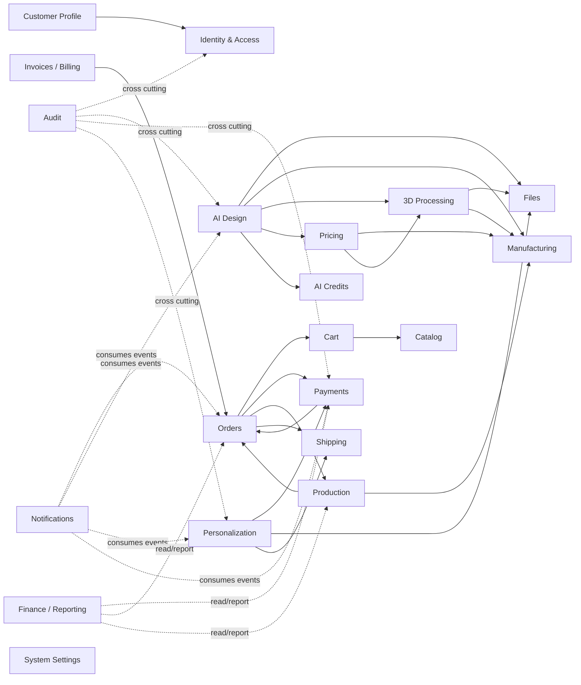

# Domain Boundaries & Module Map

**Phase:** 01 — System Blueprint & Architecture  
**Task:** 01.02 — Define bounded domains/modules  
**Document Type:** Blueprint  
**Version:** 1.0  
**Status:** Baseline  
**Related Documents:**  
- `discovery/product-scope.md`
- `discovery/domain-glossary.md`
- `discovery/business-rules.md`
- `discovery/actors-and-permissions-baseline.md`
- `discovery/non-functional-requirements.md`
- `discovery/open-research-register.md`
- `blueprint/system-overview.md`

---

# 1. Purpose

This document defines the bounded domains and module boundaries of the 3D Print Platform.

The goals are to:

- make ownership of business data explicit;
- prevent accidental coupling between modules;
- define which module is allowed to change which state;
- define synchronous vs asynchronous interactions;
- define important domain events;
- reduce future circular dependencies;
- make the Modular Monolith suitable for later extraction if needed;
- provide a stable map for backend implementation and Codex tasks.

This document describes **business/module boundaries**, not frontend pages and not database tables.

---

# 2. Architectural Principles

## 2.1 Domain boundaries represent business capabilities

A module exists because it owns a business capability, not because a page exists in the UI.

For example:

- `Admin` is not a data-owning business domain.
- `Customer Dashboard` is not a data-owning business domain.
- `Worker` is not a business domain.
- `API` is not a business domain.

These are application surfaces/processes that operate on real domains.

---

## 2.2 Each domain owns its state

Every important business record has one authoritative owner.

Examples:

- Catalog owns Products.
- Orders owns Orders and OrderItems.
- Payments owns PaymentAttempts and Refunds.
- AI Design owns DesignSessions and DesignVersions.
- Production owns ProductionJobs.
- Personalization owns PersonalizationRequests and Inspections.

Other modules may read or reference that data, but they must not directly manipulate another domain's internal state.

---

## 2.3 Cross-domain writes use public application services, commands, or events

A module must not directly call another module's repository to bypass business rules.

Preferred patterns:

```text
Module A
  ↓
Public Application Service / Command
  ↓
Module B
```

or:

```text
Module A commits durable state
  ↓
Domain Event / Outbox
  ↓
Async Consumer
  ↓
Module B
```

---

## 2.4 One physical PostgreSQL database is acceptable

The initial Modular Monolith may use one PostgreSQL database.

Logical ownership matters more than physical schema separation in MVP.

Possible implementation choices:

- one shared PostgreSQL schema with strict repository/module ownership; or
- separate PostgreSQL schemas per domain later if useful.

The important rule is:

> A module must not become dependent on another module's tables simply because they are physically in the same database.

---

## 2.5 No event sourcing requirement

The system is **not** intended to be fully event-sourced.

Use:

- regular relational state;
- explicit state machines;
- status-transition history;
- domain events;
- transactional outbox for important async integration.

Do not rebuild the entire application around an event store.

---

## 2.6 PostgreSQL remains the source of truth

Redis, queues, object storage, AI providers, payment gateways, and external APIs must not own canonical business state.

---

# 3. High-Level Domain Map



This diagram is conceptual, not a direct compile-time dependency graph.

The allowed dependency rules are defined later in this document.

---

# 4. Domain Summary

| Domain | Primary Responsibility | Owns Canonical State? |
|---|---|---|
| Identity & Access | Authentication and authorization identity | Yes |
| Customer Profile | Customer profile and addresses | Yes |
| Catalog | Sellable Ready Products and options | Yes |
| Cart | Temporary purchase intent | Yes |
| Orders | Durable commercial purchase | Yes |
| Payments | Payment attempts, verification, refunds | Yes |
| Billing / Invoice | Invoice documents and billing snapshots | Yes |
| AI Design | AI-assisted design workflow | Yes |
| AI Credits | AI usage allowance/ledger | Yes |
| Manufacturing | Workshop capabilities and hard constraints | Yes |
| 3D Processing | Technical 3D validation and slicing results | Yes |
| Pricing | Estimates, rule versions, quote calculation inputs | Yes |
| Production | Production jobs and QC execution | Yes |
| Personalization | Customer-owned-item service workflow | Yes |
| Shipping | Outbound/return shipment lifecycle | Yes |
| Files | Storage metadata and provider abstraction | Yes |
| Notifications | Notification records/delivery attempts | Yes |
| Finance / Reporting | Operational financial reporting/read models | Mostly derived |
| Audit | Append-oriented audit records | Yes |
| System Settings | Runtime business configuration | Yes |

---

# 5. Identity & Access Domain

## Responsibility

Own authentication identity and authorization primitives.

## Owns

- User identity
- Authentication credentials
- Customer OTP challenges
- Staff credentials
- Sessions / refresh tokens / revocation metadata
- Roles
- Permissions
- Role-permission assignments
- User-role assignments
- Account status/security state

## Does Not Own

- Customer addresses
- Orders
- Payments
- Production jobs
- AI sessions
- customer profile business data beyond identity essentials

## Core Entities / Aggregates

```text
User
AuthIdentity
OtpChallenge
Session
Role
Permission
UserRole
RolePermission
```

## Public Capabilities

- request OTP
- verify OTP
- staff login
- logout/revoke session
- assign/remove role
- check permission
- authorize resource access
- deactivate/reactivate account

## Emits Events

- `UserRegistered`
- `UserAuthenticated`
- `UserDeactivated`
- `RoleAssigned`
- `RoleRemoved`
- `PermissionChanged`
- `SessionRevoked`

## Consumes Events

Usually minimal.

May consume:
- customer creation/profile bootstrap requests

## Synchronous Dependencies

Should depend only on shared infrastructure, not business domains.

## Important Invariants

- OTP must expire.
- OTP must be one-time use.
- Staff auth is stronger than normal customer auth.
- Permission checks happen server-side.
- Identity status cannot be changed by unrelated business modules.

---

# 6. Customer Profile Domain

## Responsibility

Own customer business profile and reusable customer contact/address information.

## Owns

- CustomerProfile
- Address
- default address selection
- optional profile metadata

## Does Not Own

- authentication credentials
- roles/permissions
- Orders
- Payments
- AI sessions

## Core Entities / Aggregates

```text
CustomerProfile
Address
```

## Public Capabilities

- create/update profile
- add/edit/delete address
- choose default address
- retrieve customer display/contact information

## Emits Events

- `CustomerProfileCreated`
- `CustomerProfileUpdated`
- `AddressAdded`
- `AddressUpdated`
- `DefaultAddressChanged`

## Consumes Events

- `UserRegistered` → create customer profile when appropriate

## Synchronous Dependencies

- Identity for authenticated user identity

## Important Invariants

- Customers may only modify their own profile/addresses.
- Address ownership must be enforced.
- Deleting an address must not rewrite historical Order snapshots.

---

# 7. Catalog Domain

## Responsibility

Own customer-facing Ready Products and their purchasable configuration.

## Owns

- Category
- Product
- ProductMedia relation
- ProductOption
- ProductOptionValue
- base commercial price
- option price modifiers
- publication state
- SEO/public metadata
- relation/reference to a ProductionTemplate

## Does Not Own

- internal printer capability truth
- internal production settings
- Cart
- Orders
- AI designs
- final manufacturing execution

## Core Entities / Aggregates

```text
Category
Product
ProductOption
ProductOptionValue
ProductMedia
```

## Public Capabilities

- create/edit/publish Product
- manage Categories
- manage ProductOptions
- validate selected Product configuration
- calculate deterministic Ready Product configured price
- query public catalog

## Emits Events

- `ProductCreated`
- `ProductUpdated`
- `ProductPublished`
- `ProductUnpublished`
- `ProductOptionChanged`

## Consumes Events

May consume:
- file/media lifecycle events

## Synchronous Dependencies

- Files for product media references
- Manufacturing only for validating the linked ProductionTemplate/capability during admin operations

## Important Invariants

- Published Ready Products must represent known-feasible production.
- Customer may select only configured allowed options.
- Internal ProductionTemplate data is not part of public Product data.
- Catalog changes do not mutate historical OrderItems.

---

# 8. Cart Domain

## Responsibility

Own temporary purchase intent before checkout.

## Owns

- Cart
- CartItem
- item source/type
- quantity
- selected configuration reference/snapshot
- current price context

## Supported Item Sources

```text
READY_PRODUCT
APPROVED_AI_DESIGN
```

## Does Not Own

- final Order
- Payment
- ProductionJob
- PersonalizationRequest

## Core Entities / Aggregates

```text
Cart
CartItem
```

## Public Capabilities

- add item
- remove item
- update quantity
- retrieve cart
- validate cart
- calculate cart totals
- prepare checkout

## Emits Events

Usually few important async events.

Possible:
- `CartItemAdded`
- `CartClearedAfterCheckout`

These are generally not high-value integration events.

## Consumes Events

May consume:
- `ProductUnpublished` for invalidation hints
- `AIQuoteExpired` for invalidation hints

Final validity must still be checked synchronously at checkout.

## Synchronous Dependencies

- Catalog to validate Ready Product items
- AI Design / Pricing to validate approved AI purchasable items

## Important Invariants

- Personalization never enters Cart.
- Approved AI item must reference a valid approved DesignVersion and Quote.
- Cart is not a historical financial record.
- Checkout must revalidate all items.

---

# 9. Orders Domain

## Responsibility

Own durable commercial purchase records created from normal checkout.

## Owns

- Order
- OrderItem
- commercial snapshots
- Order-level lifecycle
- OrderItem fulfillment lifecycle
- status transition history
- order totals
- shipping/billing snapshots where needed

## Does Not Own

- payment provider attempts
- ProductionJob internal lifecycle
- Shipment internal lifecycle
- AI Design history
- Personalization workflow

## Core Entities / Aggregates

```text
Order
OrderItem
OrderStatusHistory
OrderItemStatusHistory
```

## OrderItem Source Types

```text
READY_PRODUCT
AI_DESIGN
```

## Public Capabilities

- create Order from validated checkout
- cancel Order if rules allow
- read Order
- update allowed Order/OrderItem lifecycle transitions
- derive overall Order status from item/payment/fulfillment state
- expose customer-facing timeline

## Emits Events

- `OrderCreated`
- `OrderPlaced`
- `OrderCancelled`
- `OrderItemCreated`
- `OrderItemReadyForProduction`
- `OrderItemCancelled`
- `OrderCompleted`

## Consumes Events

- `PaymentSucceeded`
- `PaymentFailed`
- `PaymentRefunded`
- `ProductionJobCompleted`
- `QCApproved`
- `ShipmentCreated`
- `ShipmentDelivered`

## Synchronous Dependencies

- Cart during checkout preparation
- Customer Profile for address/customer snapshot
- Catalog/AI Design for purchase snapshots

Should **not** depend on concrete ZarinPal integration.

## Important Invariants

- Order creation is atomic.
- OrderItem snapshot remains historically stable.
- Order and OrderItem states are separate.
- Payment status is not stored as the same concept as Order lifecycle.
- One Order may contain items at different fulfillment states.

---

# 10. Payments Domain

## Responsibility

Own monetary payment execution and provider verification.

## Owns

- Payment
- PaymentAttempt
- Refund
- provider references
- provider verification result
- payment status
- payment allocation metadata
- idempotency metadata

## Payable Targets

The domain should support generic payable references where practical.

Examples:

```text
ORDER
PERSONALIZATION_REQUEST
PERSONALIZATION_BALANCE
```

## Does Not Own

- Order status
- Personalization lifecycle
- Quote business rules
- Production lifecycle

## Core Entities / Aggregates

```text
Payment
PaymentAttempt
Refund
PaymentAllocation
```

## Public Capabilities

- create payment request
- redirect/start provider payment
- verify callback
- reconcile payment
- create/ref record Refund
- query paid amount
- allocate payment to payable obligation

## Emits Events

- `PaymentInitiated`
- `PaymentSucceeded`
- `PaymentFailed`
- `PaymentCancelled`
- `PaymentRefunded`
- `PaymentReconciled`

## Consumes Events

May consume:
- `OrderCreated`
- `PersonalizationQuoteAccepted`
- `BalancePaymentRequired`

## Synchronous Dependencies

- external PaymentProvider adapter
- no direct dependency on Orders repositories

## Important Invariants

- verification must be server-side.
- callback processing must be idempotent.
- amount must match expected payable amount.
- successful payment cannot be applied twice.
- payment state remains separate from business workflow state.

---

# 11. Billing / Invoice Domain

## Responsibility

Own generated invoice documents and invoice snapshots.

## Owns

- Invoice
- invoice number
- invoice line snapshots
- invoice file reference
- billing metadata

## Does Not Own

- Order mutable state
- PaymentAttempt
- accounting ledger

## Core Entities

```text
Invoice
InvoiceLine
```

## Public Capabilities

- generate invoice
- regenerate corrected document where policy permits
- retrieve invoice
- generate/store PDF

## Emits Events

- `InvoiceGenerated`
- `InvoiceRegenerated`

## Consumes Events

- `PaymentSucceeded`
- `OrderCreated`
- `PersonalizationQuotePaid`
- possibly `OrderCompleted`

## Synchronous Dependencies

- Orders / Personalization for commercial snapshot input
- Payments for paid/balance snapshot
- Files for PDF storage

## Important Invariants

- Invoice is a business document, not the source of Order/Payment truth.
- Invoice number must be unique.
- historical invoice data should remain traceable.

---

# 12. AI Design Domain

## Responsibility

Own the AI-assisted product-design workflow and its versions.

## Owns

- DesignSession
- Message
- DesignVersion
- final candidate selection
- generation-job business references
- provider metadata reference
- review submission state
- AI approval/rejection state
- customer-visible design workflow state

## Does Not Own

- manufacturing truth
- 3D validation algorithms
- slicer execution
- final pricing formula
- payment
- production job execution

## Core Entities / Aggregates

```text
DesignSession
DesignMessage
DesignVersion
DesignReview
```

## Public Capabilities

- create session
- send message
- attach references
- create DesignVersion
- mark final candidate
- submit for review
- approve/reject/request revision
- create purchasable reference after approved locked Quote

## Emits Events

- `DesignSessionStarted`
- `DesignMessageAdded`
- `DesignVersionCreated`
- `Design3DGenerationRequested`
- `Design3DGenerationCompleted`
- `DesignValidationRequested`
- `DesignVersionFinalized`
- `DesignSubmittedForReview`
- `DesignApproved`
- `DesignRejected`
- `DesignRevisionRequested`

## Consumes Events

- `ThreeDGenerationCompleted`
- `ThreeDGenerationFailed`
- `ValidationPassed`
- `ValidationFailed`
- `PriceEstimateCreated`
- `QuoteApproved`
- `QuoteExpired`

## Synchronous Dependencies

- Manufacturing for capability queries
- Files for design/reference assets
- AI Credits for usage authorization
- Pricing for estimate/quote orchestration

## Important Invariants

- DesignVersion is immutable.
- rejected version is not silently edited.
- AI cannot approve itself.
- approved purchasable design references one explicit DesignVersion.
- AI workflow cannot directly trigger Payment or Production.

---

# 13. AI Credits Domain

## Responsibility

Own credit/allowance accounting for expensive AI/provider operations.

## Owns

- credit ledger
- grants
- consumption
- reversals/refunds
- admin adjustments
- operation cost mapping/config reference
- user credit balance projection

## Does Not Own

- provider billing invoices
- Toman payment accounting
- AI conversation content
- provider job lifecycle

## Core Entities / Aggregates

```text
CreditAccount
CreditTransaction
AIUsageRecord
```

## Public Capabilities

- check allowance
- reserve/consume credits
- reverse failed consumption
- admin grant/adjust
- calculate balance
- record AI usage

## Emits Events

- `AICreditsGranted`
- `AICreditsConsumed`
- `AICreditsReversed`
- `AICreditBalanceLow`

## Consumes Events

- `AIOperationSucceeded`
- `AIOperationFailed`
- `ThreeDGenerationFailed`

## Synchronous Dependencies

Minimal.

May reference:
- Identity user ID
- AI Design session/version IDs

## Important Invariants

- Ledger history must be preserved.
- Balance should be derived or transactionally maintained from ledger.
- Failed provider jobs must follow explicit reconciliation policy.
- AI Credits are not Toman currency.

---

# 14. Manufacturing Domain

## Responsibility

Own the workshop's hard production capabilities and deterministic manufacturing constraints.

## Owns

- Printer
- PrinterProfile
- Material
- Color
- capability definitions
- compatibility mappings
- ManufacturingRule
- ProductionTemplate

## Does Not Own

- AI conversation
- Order
- ProductionJob execution
- pricing formula
- slicer job result

## Core Entities / Aggregates

```text
Printer
PrinterProfile
Material
Color
ManufacturingRule
ProductionTemplate
```

## Public Capabilities

- query capabilities
- validate supported material/color/printer combinations
- manage rules
- manage ProductionTemplates
- expose normalized manufacturing constraints
- answer capability queries for AI/validation/pricing

## Emits Events

- `PrinterCapabilityChanged`
- `MaterialChanged`
- `ManufacturingRuleChanged`
- `ProductionTemplateChanged`

## Consumes Events

Usually minimal.

## Synchronous Dependencies

- Files for ProductionTemplate assets

## Important Invariants

- hard manufacturing rules live here, not only in prompts.
- AI Design may query Manufacturing.
- Manufacturing must never depend on AI Design.
- Manufacturing rules should be versioned/traceable where historically important.

---

# 15. 3D Processing Domain

## Responsibility

Own technical processing of 3D assets.

## Owns

- ThreeDAsset metadata specific to processing
- validation job/result
- geometry metadata
- slicing job/result
- extracted manufacturing metrics
- technical processing logs/reference

## Does Not Own

- customer design approval
- final quote
- ProductionJob
- pricing rules
- manufacturing policy source of truth

## Core Entities

```text
ThreeDProcessingJob
MeshValidationResult
SliceJob
SliceResult
ManufacturingMetrics
```

## Public Capabilities

- validate model/file
- inspect geometry
- calculate bounding dimensions
- invoke manufacturing-rule checks
- slice model
- extract print metrics

## Emits Events

- `ThreeDValidationStarted`
- `ThreeDValidationPassed`
- `ThreeDValidationFailed`
- `SliceStarted`
- `SliceCompleted`
- `SliceFailed`
- `ManufacturingMetricsCreated`

## Consumes Events

- `Design3DGenerationCompleted`
- retry commands

## Synchronous Dependencies

- Files for assets
- Manufacturing for deterministic capability/rule evaluation

## Important Invariants

- processing failure must be distinguishable from model invalidity.
- raw provider response is not the domain contract.
- expensive slicing runs in isolated worker/process.
- output metrics are persisted durably.

---

# 16. Pricing Domain

## Responsibility

Own deterministic price estimation and price-rule versioning.

## Owns

- PriceRuleSet
- PriceRuleVersion
- PriceEstimate
- estimate breakdown
- pricing metadata
- applied rule version

Depending on final design, Quote ownership may remain in this domain or be separated into a commercial Quote submodule.

For this blueprint, **Pricing owns the commercial Quote calculation/locking model for AI Designs**, while Personalization owns the service-specific quote lifecycle and references shared pricing/payment concepts.

## Does Not Own

- slicer execution
- material capability truth
- payment execution
- AI reasoning
- ProductionJob

## Core Entities / Aggregates

```text
PriceRuleSet
PriceEstimate
AIQuote
```

## Public Capabilities

- calculate estimate
- create AI Quote
- approve/lock quote
- admin override with reason
- validate quote expiry
- retrieve breakdown
- resolve applicable pricing-rule version

## Emits Events

- `PriceEstimateCreated`
- `AIQuoteCreated`
- `AIQuoteAdjusted`
- `AIQuoteApproved`
- `AIQuoteLocked`
- `AIQuoteExpired`

## Consumes Events

- `ManufacturingMetricsCreated`
- `DesignSubmittedForReview`

## Synchronous Dependencies

- Manufacturing for normalized material/printer/rule data
- 3D Processing for persisted normalized metrics

## Important Invariants

- LLM does not calculate authoritative final price.
- estimate preserves applied rule version.
- override preserves original estimate and reason.
- only locked approved quote is purchasable.
- pricing formula remains TBD until research resolves it.

---

# 17. Production Domain

## Responsibility

Own actual manufacturing work execution after purchase/approval.

## Owns

- ProductionJob
- assignment
- production status
- start/completion timestamps
- printer/profile actually used
- operator notes
- failure/rework history
- QC record or tightly related QC subdomain

## Does Not Own

- Order commercial snapshots
- payment verification
- ManufacturingRule definitions
- AI Design workflow

## Core Entities / Aggregates

```text
ProductionJob
ProductionJobStatusHistory
QualityControlRecord
ReworkRecord
```

## Public Capabilities

- create production job
- assign operator
- start job
- record printer/profile
- record failure
- request rework
- submit for QC
- approve/fail QC
- complete job

## Emits Events

- `ProductionJobCreated`
- `ProductionJobAssigned`
- `ProductionJobStarted`
- `ProductionJobFailed`
- `ProductionJobReworkRequested`
- `ProductionJobCompleted`
- `QCApproved`
- `QCRejected`

## Consumes Events

- `OrderItemReadyForProduction`
- approved AI purchase events

## Synchronous Dependencies

- Manufacturing for ProductionTemplate/capabilities
- Files for internal production assets

## Important Invariants

- ProductionJob is separate from OrderItem state.
- production cannot start before required commercial/payment gate.
- QC required before item is considered ready for fulfillment.
- rework/failure path must exist.

---

# 18. Personalization Domain

## Responsibility

Own the service workflow for modifying a customer-owned physical item.

## Owns

- PersonalizationRequest
- request reference media relation
- admin review state
- PersonalizationQuote
- deposit requirement/config
- physical item receipt
- Inspection
- ManualWorkJob
- service lifecycle
- remaining-balance requirement reference
- return-readiness state

## Does Not Own

- generic PaymentAttempt execution
- file binary storage
- generic Shipment implementation
- customer identity/auth

## Core Entities / Aggregates

```text
PersonalizationRequest
PersonalizationReview
PersonalizationQuote
PhysicalItemReceipt
Inspection
ManualWorkJob
PersonalizationStatusHistory
```

## Public Capabilities

- submit request
- approve/reject/request clarification
- create/revise quote
- accept deposit/full payment result
- mark awaiting physical item
- record item received
- inspect item
- accept/reject/requote
- assign manual work
- mark QC outcome
- require remaining balance
- mark ready for return

## Emits Events

- `PersonalizationRequestSubmitted`
- `PersonalizationRequestApproved`
- `PersonalizationRequestRejected`
- `PersonalizationQuoteCreated`
- `PersonalizationQuoteAccepted`
- `CustomerItemReceived`
- `InspectionPassed`
- `InspectionFailed`
- `PersonalizationRequoteRequired`
- `ManualWorkStarted`
- `ManualWorkCompleted`
- `PersonalizationQCApproved`
- `BalancePaymentRequired`
- `PersonalizationReadyForReturn`

## Consumes Events

- `PaymentSucceeded`
- `PaymentRefunded`
- `ShipmentDelivered`

## Synchronous Dependencies

- Files
- Payments
- Customer Profile
- Shipping for return shipment creation

## Important Invariants

- never uses normal Cart.
- quote must exist before normal "awaiting physical item" progression.
- physical Inspection is mandatory before manual work.
- item may be rejected after receipt.
- remaining balance blocks return shipment where required.

---

# 19. Shipping / Fulfillment Domain

## Responsibility

Own shipment records and shipment lifecycle.

## Owns

- ShippingMethod
- Shipment
- ShipmentTrackingEvent
- carrier/method reference
- tracking code
- dispatch/delivery timestamps

## Does Not Own

- Order commercial lifecycle
- production
- payment
- Personalization Inspection

## Core Entities

```text
ShippingMethod
Shipment
ShipmentTrackingEvent
```

## Public Capabilities

- manage shipping methods
- create shipment
- attach items/order/service reference
- set tracking code
- mark shipped
- update tracking
- mark delivered

## Emits Events

- `ShipmentCreated`
- `ShipmentDispatched`
- `ShipmentTrackingUpdated`
- `ShipmentDelivered`

## Consumes Events

- `OrderItemReadyToShip`
- `PersonalizationReadyForReturn`

## Synchronous Dependencies

Potential external carrier adapter.

## Important Invariants

- shipment state separate from Order state.
- personalization return shipment blocked until required balance is paid.
- inbound personalization transport may remain external/customer-managed.

---

# 20. Files / Storage Domain

## Responsibility

Own storage metadata and provider-independent file access.

## Owns

- StorageAsset
- storage key
- MIME
- size
- visibility
- checksum where useful
- upload state
- lifecycle metadata

## Does Not Own

- semantic business meaning of Product/Design/Invoice itself
- Product media ordering
- AI Design state
- Invoice business state

## Core Entities

```text
StorageAsset
UploadSession
```

## Public Capabilities

- create upload authorization
- store metadata
- generate signed URL
- validate upload
- delete/archive asset
- resolve asset access
- provider abstraction

## Emits Events

- `FileUploaded`
- `FileValidated`
- `FileRejected`
- `FileDeleted`

## Consumes Events

- cleanup requests
- entity deletion/archive signals where appropriate

## Synchronous Dependencies

- external object storage adapter

## Important Invariants

- business modules refer to file IDs/StorageAssets, not raw provider internals.
- large binary files are not stored in PostgreSQL by default.
- private assets remain private by default.

---

# 21. Notifications Domain

## Responsibility

Own notification creation and delivery tracking.

## Owns

- Notification
- NotificationTemplate
- NotificationDeliveryAttempt
- channel
- delivery state
- read/unread state for in-app notifications

## Does Not Own

- business state that caused the notification
- Order status
- Payment status
- AI approval state

## Core Entities

```text
Notification
NotificationTemplate
NotificationDeliveryAttempt
```

## Public Capabilities

- create notification
- render template
- enqueue delivery
- record delivery result
- mark read/unread

## Emits Events

- `NotificationDelivered`
- `NotificationFailed`

## Consumes Events

Examples:

- `PaymentSucceeded`
- `DesignApproved`
- `DesignRejected`
- `ProductionJobStarted`
- `QCApproved`
- `ShipmentDispatched`
- `PersonalizationQuoteCreated`
- `InspectionPassed`
- `BalancePaymentRequired`

## Synchronous Dependencies

- external SMS adapter
- Identity/Customer Profile for destination lookup if needed

## Important Invariants

- notification failure must not roll back business state.
- notifications must never decide core business transitions.
- retries must avoid harmful duplicate delivery where practical.

---

# 22. Finance / Reporting Domain

## Responsibility

Provide operational financial views and reporting.

## Owns

Primarily derived/read-model/reporting data.

May own:
- cost-entry records not naturally owned elsewhere
- reporting snapshots
- manual operational cost records

## Reads From

- Payments
- Orders
- Personalization
- Production
- Pricing

## Does Not Own

- canonical Payment state
- Order state
- Refund execution
- accounting general ledger

## Public Capabilities

- revenue report
- outstanding balance report
- deposit report
- refund report
- basic cost report
- basic profit report

## Emits Events

Usually none that affect core workflow.

## Consumes Events

May asynchronously update reporting projections from:

- `PaymentSucceeded`
- `PaymentRefunded`
- `OrderCompleted`
- `ProductionJobCompleted`

## Important Invariants

- Finance is downstream from operational truth.
- Finance must not mutate Payment/Order state.
- this is not full double-entry accounting.

---

# 23. Audit Domain

## Responsibility

Own append-oriented records of privileged/sensitive actions.

## Owns

- AuditLog
- actor
- action
- resource
- reason
- relevant before/after metadata
- request/security metadata
- timestamp

## Does Not Own

- actual business state
- security policy decision itself

## Public Capabilities

- append audit entry
- search/filter audit entries
- expose privileged audit history

## Emits Events

Usually unnecessary.

## Consumes Events

May consume privileged domain events, but explicit application-level audit calls may also be appropriate for important actions.

## Important Invariants

- audit records should not be silently edited.
- audit must never contain secrets unnecessarily.
- audit failure handling must be designed carefully for critical actions.

---

# 24. System Settings Domain

## Responsibility

Own runtime business configuration that is not deployment-secret configuration.

## Owns

Examples:

- business display information
- default operational limits
- configurable feature flags
- quote defaults
- shipping defaults
- AI credit operation settings
- customer-facing lead-time settings

## Does Not Own

- `.env` secrets
- database credentials
- provider API keys
- domain-owned rules that require their own versioning model

## Public Capabilities

- read setting
- update setting
- validate setting
- audit setting change

## Emits Events

- `BusinessSettingChanged`

## Important Invariants

- secrets are not stored as ordinary runtime business settings.
- domain-critical versioned rules stay with their owning domain.

---

# 25. Administration Is Not a Data-Owning Domain

`Admin Panel` is an application surface.

It uses the public capabilities of:

- Catalog
- Orders
- Payments
- AI Design
- Pricing
- Manufacturing
- Production
- Personalization
- Shipping
- Finance
- Identity
- Audit
- System Settings

Admin code must not bypass these modules by editing their tables directly.

Conceptually:

```text
Admin UI
  ↓
Admin/API Application Layer
  ↓
Domain Public Services
```

not:

```text
Admin UI
  ↓
Generic DB Editor
```

---

# 26. Customer Dashboard Is Not a Data-Owning Domain

The Customer Dashboard is a read/application surface over several domains.

It may aggregate:

- Orders
- Payments
- Invoices
- Shipments
- AI Design
- Personalization
- Notifications
- Customer Profile

It should not duplicate canonical state unnecessarily.

---

# 27. Worker Is Not a Domain

The Worker is an execution process.

It runs application/use-case handlers belonging to domains such as:

- AI Design
- 3D Processing
- Billing
- Notifications

The same domain rules must apply whether a use case runs inside API or Worker process.

---

# 28. Important Dependency Rules

## Rule D-001 — Manufacturing must not depend on AI Design

Allowed:

```text
AI Design → Manufacturing
```

Forbidden:

```text
Manufacturing → AI Design
```

Manufacturing is a lower-level business capability and must remain reusable.

---

## Rule D-002 — 3D Processing may depend on Manufacturing rules

Allowed:

```text
3D Processing → Manufacturing
```

3D Processing needs normalized capabilities/rules.

Manufacturing must not depend on 3D Processing implementation details.

---

## Rule D-003 — Pricing may consume normalized metrics

Allowed:

```text
Pricing → 3D Processing results
Pricing → Manufacturing configuration
```

Forbidden:

```text
3D Processing → Pricing
Manufacturing → Pricing
```

Technical processing should not know commercial pricing.

---

## Rule D-004 — Orders must not depend on ZarinPal

Allowed:

```text
Orders ↔ Payments (domain contract/events)
Payments → ZarinPal Adapter
```

Forbidden:

```text
Orders → ZarinPal SDK
```

---

## Rule D-005 — Production starts from an approved commercial gate

Production may react to:

- paid OrderItem;
- explicitly authorized production command.

Production must not decide whether a Payment is valid.

---

## Rule D-006 — Notifications are downstream

Allowed:

```text
Business Event → Notifications
```

Forbidden:

```text
Notifications → mutate business state
```

---

## Rule D-007 — Finance is downstream

Finance/reporting may read/consume operational events.

It must not become the authority for:

- payment state;
- order state;
- production state.

---

## Rule D-008 — Files own storage mechanics, domains own semantic meaning

Example:

- Files knows: asset key, size, MIME, visibility.
- AI Design knows: "this file is reference image for DesignVersion 4."
- Billing knows: "this file is Invoice #123 PDF."

---

# 29. Suggested Compile-Time Dependency Direction

A practical NestJS dependency direction should aim for:

```text
Shared Kernel / Common primitives
        ↓
Identity
Customer
Files
Manufacturing
        ↓
Catalog
3D Processing
AI Credits
        ↓
AI Design
Pricing
Cart
        ↓
Orders
Payments
Production
Personalization
Shipping
Billing
        ↓
Notifications
Finance / Reporting
Admin Application Surface
```

This is not a strict total order, but it illustrates the desired direction.

Avoid circular module imports.

---

# 30. Cross-Domain Interaction Examples

## 30.1 Ready Product Checkout

```text
Cart
  → Catalog.validateConfiguration()
  → Orders.createOrder()
  → Payments.createPayment()

PaymentSucceeded event
  → Orders.markPaid()
  → Orders emits OrderItemReadyForProduction

OrderItemReadyForProduction
  → Production.createJob()
```

---

## 30.2 AI Design Purchase

```text
AI Design
  → 3D Processing
  → Manufacturing validation
  → Pricing.createEstimate()
  → Admin review
  → Pricing.lockQuote()
  → Cart.addApprovedAIDesign()
  → Orders.createOrder()
  → Payments
  → Production
```

---

## 30.3 Personalization

```text
Personalization.submitRequest()
  → Admin review
  → Personalization.createQuote()
  → Payments

PaymentSucceeded
  → Personalization.markDepositOrPaid()
  → Awaiting Physical Item

Item Received
  → Inspection
  → Manual Work
  → QC
  → Balance Required
  → Payments
  → Shipping.createReturnShipment()
```

---

# 31. Domain Event Catalog — Initial Baseline

The exact event payloads are defined in Task `01.05`.

Initial event names:

## Identity

- `UserRegistered`
- `UserDeactivated`
- `RoleAssigned`
- `RoleRemoved`

## Catalog

- `ProductPublished`
- `ProductUnpublished`
- `ProductUpdated`

## Orders

- `OrderCreated`
- `OrderPlaced`
- `OrderCancelled`
- `OrderItemReadyForProduction`
- `OrderCompleted`

## Payments

- `PaymentInitiated`
- `PaymentSucceeded`
- `PaymentFailed`
- `PaymentRefunded`

## AI Design

- `DesignSessionStarted`
- `DesignVersionCreated`
- `Design3DGenerationRequested`
- `DesignVersionFinalized`
- `DesignSubmittedForReview`
- `DesignApproved`
- `DesignRejected`

## 3D Processing

- `ThreeDGenerationCompleted`
- `ThreeDGenerationFailed`
- `ValidationPassed`
- `ValidationFailed`
- `SliceCompleted`
- `SliceFailed`
- `ManufacturingMetricsCreated`

## Pricing

- `PriceEstimateCreated`
- `AIQuoteCreated`
- `AIQuoteAdjusted`
- `AIQuoteApproved`
- `AIQuoteLocked`
- `AIQuoteExpired`

## Production

- `ProductionJobCreated`
- `ProductionJobStarted`
- `ProductionJobFailed`
- `ProductionJobCompleted`
- `QCApproved`
- `QCRejected`

## Personalization

- `PersonalizationRequestSubmitted`
- `PersonalizationRequestApproved`
- `PersonalizationRequestRejected`
- `PersonalizationQuoteAccepted`
- `CustomerItemReceived`
- `InspectionPassed`
- `InspectionFailed`
- `ManualWorkStarted`
- `ManualWorkCompleted`
- `BalancePaymentRequired`
- `PersonalizationReadyForReturn`

## Shipping

- `ShipmentCreated`
- `ShipmentDispatched`
- `ShipmentDelivered`

---

# 32. Transaction Boundaries

Use a local database transaction when a domain invariant requires several writes to succeed together.

Examples:

## Orders

```text
Create Order
Create OrderItems
Save commercial snapshots
Write transition/history
Write outbox event
```

should be one logical transaction.

## Payments

```text
Verify payment
Mark Payment succeeded
Record provider reference
Create allocation
Write outbox event
```

should be transactionally consistent.

## Pricing

```text
Lock Quote
Record applied estimate
Record adjustment reason
Write status history
```

should be atomic.

---

# 33. Transactional Outbox

Important domain events should be persisted in the same transaction as the business state change.

Conceptually:

```text
BEGIN
  UPDATE business_state
  INSERT outbox_event
COMMIT
```

A worker/publisher later sends the event to BullMQ or another internal event transport.

This reduces the risk of:

```text
DB commit succeeds
BUT
queue publish fails
```

and the workflow silently stops.

Likely outbox-worthy events include:

- `PaymentSucceeded`
- `OrderItemReadyForProduction`
- `Design3DGenerationRequested`
- `DesignApproved`
- `BalancePaymentRequired`
- `ShipmentDispatched`

---

# 34. Read Models / Query Aggregation

Some screens need information from multiple domains.

Examples:

- Customer Dashboard
- Admin Order Detail
- AI Review screen
- Finance Dashboard

Do not solve this by letting UI directly join random domain tables.

Preferred options:

1. application query service orchestrates domain read APIs;
2. dedicated read model/projection;
3. optimized database query owned by a reporting/query layer with clear read-only rules.

Commands/writes still go to the owning domain.

---

# 35. Anti-Corruption Layer for External Providers

External APIs must be normalized behind internal interfaces.

Examples:

```text
PaymentProvider
SmsProvider
AIProvider
ThreeDGenerationProvider
ObjectStorageProvider
ShippingProvider
```

Provider-specific statuses must be translated into internal stable concepts.

Do not let provider terminology become core domain terminology.

---

# 36. Domain Boundary Anti-Patterns

The implementation should avoid:

## 36.1 Shared "God Service"

Example:

```text
PlatformService
  - creates orders
  - verifies payments
  - calls OpenAI
  - updates production
  - sends SMS
```

This destroys domain boundaries.

---

## 36.2 Direct cross-module repository access

Bad:

```text
PaymentsService
  → OrdersRepository.updateStatus(...)
```

Better:

```text
PaymentSucceeded
  → Orders payment handler
```

or explicit public application service.

---

## 36.3 Generic status field for everything

Bad:

```text
Order.status = "printing"
```

This confuses commercial, production, payment, and shipment state.

---

## 36.4 Provider data as domain model

Bad:

```text
Order.zarinpal_status
Design.meshy_status
```

Prefer provider-neutral internal concepts plus provider metadata.

---

## 36.5 Business rules hidden in frontend

Any critical rule enforced only in Next.js is invalid architecture.

---

# 37. Recommended NestJS Module Map

A likely high-level backend structure:

```text
src/
  modules/
    identity/
    customers/
    catalog/
    cart/
    orders/
    payments/
    billing/
    ai-design/
    ai-credits/
    manufacturing/
    three-d-processing/
    pricing/
    production/
    personalization/
    shipping/
    files/
    notifications/
    finance/
    audit/
    settings/

  shared/
    database/
    config/
    queue/
    logging/
    errors/
    events/
    authz/
```

Exact folder layout is implementation detail and may evolve.

---

# 38. Domain Ownership Matrix

| Data / Concept | Owning Domain |
|---|---|
| User identity | Identity |
| OTP challenge | Identity |
| Role / Permission | Identity |
| Customer profile | Customer Profile |
| Address | Customer Profile |
| Product | Catalog |
| ProductOption | Catalog |
| ProductionTemplate | Manufacturing |
| Cart | Cart |
| CartItem | Cart |
| Order | Orders |
| OrderItem | Orders |
| Payment | Payments |
| PaymentAttempt | Payments |
| Refund | Payments |
| Invoice | Billing |
| DesignSession | AI Design |
| DesignMessage | AI Design |
| DesignVersion | AI Design |
| AIUsageRecord | AI Credits |
| CreditTransaction | AI Credits |
| Printer | Manufacturing |
| PrinterProfile | Manufacturing |
| Material | Manufacturing |
| Color | Manufacturing |
| ManufacturingRule | Manufacturing |
| MeshValidationResult | 3D Processing |
| SliceResult | 3D Processing |
| ManufacturingMetrics | 3D Processing |
| PriceRuleSet | Pricing |
| PriceEstimate | Pricing |
| AIQuote | Pricing |
| ProductionJob | Production |
| QC Record | Production |
| PersonalizationRequest | Personalization |
| PhysicalItemReceipt | Personalization |
| Inspection | Personalization |
| ManualWorkJob | Personalization |
| ShippingMethod | Shipping |
| Shipment | Shipping |
| StorageAsset | Files |
| Notification | Notifications |
| AuditLog | Audit |
| Business Setting | System Settings |

---

# 39. Key Invariants Across Domains

The following invariants span multiple domains and must be preserved through explicit contracts/events:

1. **No paid state without verified payment.**
2. **No AI purchase without approved DesignVersion and locked Quote.**
3. **No ProductionJob before required payment/commercial gate.**
4. **No Personalization manual work before physical Inspection acceptance.**
5. **No Personalization return shipment while required balance is unpaid.**
6. **No customer access to another customer's private resource.**
7. **No business-critical hard rule enforced only by AI prompt/RAG.**
8. **No historical OrderItem price/config rewritten by later catalog changes.**
9. **No notification failure allowed to reverse core business state.**
10. **No external provider allowed to become canonical business truth.**

---

# 40. Decisions Deferred to Later Tasks

This document intentionally does not finalize:

- exact entity attributes;
- database schema;
- exact event payloads;
- queue names;
- event transport implementation;
- exact state values/transitions;
- exact quote ownership implementation details;
- exact repository pattern;
- exact ORM;
- exact module export/import structure.

These are refined in:

- `01.03 — Model core entity relationships`
- `01.04 — Define state machines`
- `01.05 — Define event model`
- `01.06 — Record baseline ADRs`

---

# 41. Completion Criteria

Task `01.02 — Define bounded domains/modules` is complete when:

- all major business capabilities have a clear owning domain;
- every major business entity has one canonical owner;
- allowed dependency direction is documented;
- forbidden dependency patterns are documented;
- shared application surfaces are distinguished from domains;
- major cross-domain events are identified;
- sync vs async interaction guidance is documented;
- important cross-domain invariants are explicit;
- Admin, Dashboard, and Worker are correctly treated as application surfaces/processes rather than data-owning domains.

