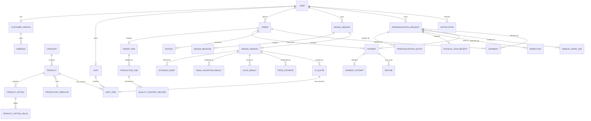
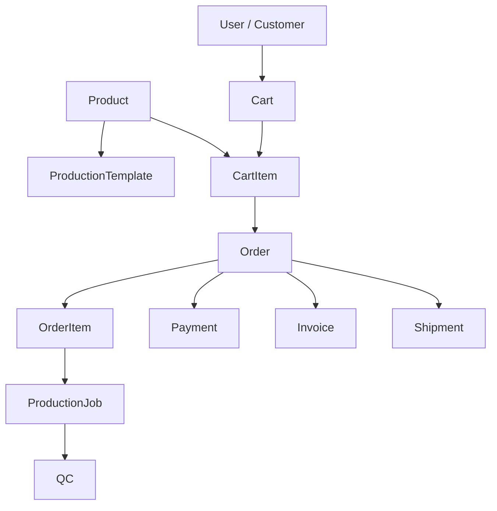
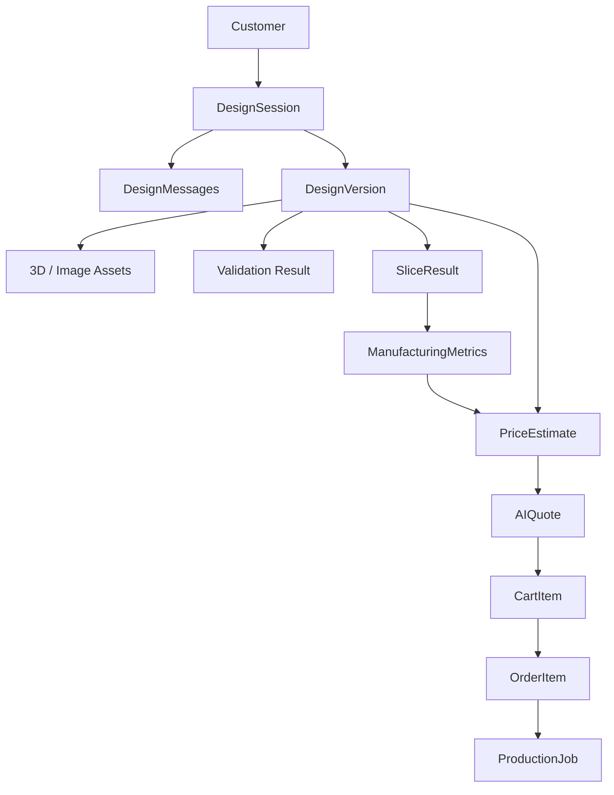
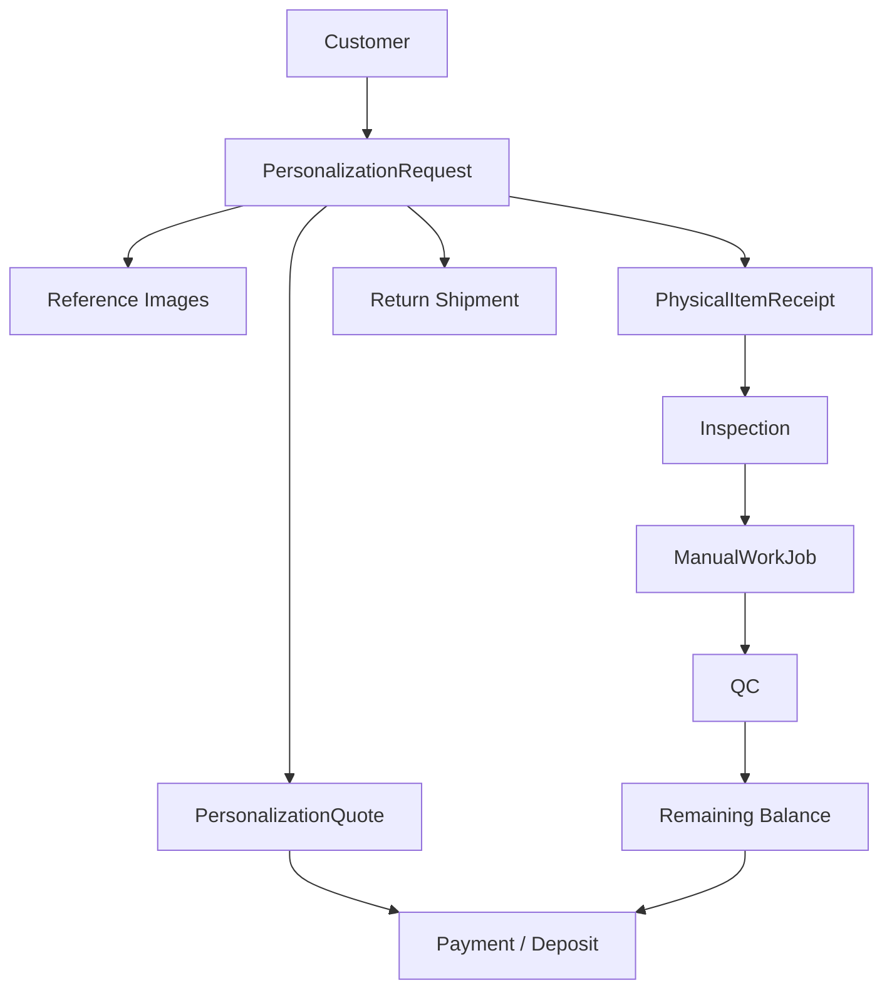

# Core Entity Relationships

**Phase:** 01 — System Blueprint & Architecture  
**Task:** 01.03 — Model core entity relationships  
**Document Type:** Blueprint  
**Version:** 1.0  
**Status:** Baseline  
**Related Documents:**
- `discovery/domain-glossary.md`
- `discovery/business-rules.md`
- `blueprint/system-overview.md`
- `blueprint/domains.md`

---

# 1. Purpose

This document defines the conceptual relationships between the core entities of the 3D Print Platform.

It establishes:

- aggregate roots;
- entity ownership;
- cardinality;
- cross-domain references;
- historical snapshot rules;
- lifecycle relationships;
- where references should remain loose rather than tightly coupled;
- which relationships are business relationships versus implementation/database relationships.

This document is **not** the final PostgreSQL schema.

It intentionally does not define:

- exact table names;
- exact column names;
- exact indexes;
- ORM decorators;
- final foreign-key implementation;
- all optional metadata fields.

Those details belong to the database architecture and implementation phases.

---

# 2. Modeling Principles

## 2.1 One canonical owner per entity

Every core entity has one owning domain.

Other domains may reference that entity, but must not take ownership of its lifecycle.

---

## 2.2 Aggregate boundaries matter more than table joins

Entities inside one aggregate may usually be changed transactionally through the aggregate root.

Cross-aggregate changes should happen through:

- application services;
- commands;
- domain events;
- outbox-driven async handlers.

---

## 2.3 Historical commerce uses snapshots

Historical commercial records must not depend on mutable catalog/profile data.

Examples:

- `OrderItem` stores purchased product/design data as a snapshot.
- `Order` stores shipping/customer information required for history.
- `Invoice` stores invoice lines rather than rendering directly from the current Product.

---

## 2.4 Cross-domain IDs are references, not ownership

Example:

```text
ProductionJob.orderItemId
```

means:

> this production job is associated with that OrderItem

It does **not** mean Production owns or can freely mutate the OrderItem.

---

## 2.5 Physical foreign keys are not mandatory across every domain boundary

Within one PostgreSQL database, cross-domain foreign keys may be useful.

However, a foreign key must not be mistaken for permission to bypass module boundaries.

The final database design may choose between:

- physical FK;
- validated logical reference;
- immutable external identifier;

based on lifecycle and coupling concerns.

---

# 3. Aggregate Roots

Initial aggregate roots:

```text
Identity
  User
  Role

Customer
  CustomerProfile

Catalog
  Product
  Category

Manufacturing
  ProductionTemplate
  Printer
  Material
  ManufacturingRule

Cart
  Cart

Orders
  Order

Payments
  Payment
  Refund

Billing
  Invoice

AI Design
  DesignSession
  DesignVersion / review lifecycle via DesignSession

AI Credits
  CreditAccount

3D Processing
  ThreeDProcessingJob
  SliceJob

Pricing
  PriceRuleSet
  PriceEstimate
  AIQuote

Production
  ProductionJob

Personalization
  PersonalizationRequest

Shipping
  ShippingMethod
  Shipment

Files
  StorageAsset

Notifications
  Notification

Audit
  AuditLog

System Settings
  BusinessSetting
```

Some exact aggregate boundaries may be refined during implementation, but the ownership direction should remain stable.

---

# 4. Global Relationship Overview



This is a conceptual relationship diagram. It intentionally simplifies some provider/file/audit relations.

---

# 5. Identity and Customer Relationships

## 5.1 User

`User` is the identity-level representation of a person/account.

### Relationships

```text
User 1 ── 0..1 CustomerProfile
User * ── * Role
Role * ── * Permission
User 1 ── * Session
User 1 ── * OtpChallenge
```

### Notes

- A normal customer User will usually have one CustomerProfile.
- Staff users may not require a normal customer profile.
- One User may eventually hold multiple roles.
- Authorization must not depend on a single `role` column on User.

---

## 5.2 CustomerProfile

`CustomerProfile` owns customer-facing reusable profile information.

### Relationships

```text
CustomerProfile 1 ── * Address
CustomerProfile 1 ── * Order        (logical ownership/reference)
CustomerProfile 1 ── * DesignSession
CustomerProfile 1 ── * PersonalizationRequest
```

### Historical Rule

Orders must not read current customer/address values to reconstruct historical checkout data.

Relevant customer/address details must be snapshotted at purchase time.

---

# 6. Catalog Relationships

## 6.1 Category

```text
Category 1 ── * Product
Category 0..1 ── * Category
```

A hierarchical category structure may be supported later.

The exact tree implementation is deferred.

---

## 6.2 Product

`Product` is the customer-facing sellable Ready Product.

### Relationships

```text
Category 1 ── * Product

Product 1 ── * ProductOption
Product 1 ── * ProductMedia
Product 1 ── 1 ProductionTemplate reference
Product 1 ── * CartItem references
Product 1 ── * historical OrderItem snapshots
```

### Important Rule

An `OrderItem` must not depend on the mutable Product record for historical:

- title;
- price;
- chosen options;
- public description needed for invoice/order history.

---

## 6.3 ProductOption

```text
Product 1 ── * ProductOption
ProductOption 1 ── * ProductOptionValue
```

Example:

```text
Product
  "Custom Lamp"

ProductOption
  "Color"

ProductOptionValues
  Black
  White
  Red
```

A value may include a deterministic price modifier.

---

# 7. Manufacturing Relationships

## 7.1 ProductionTemplate

`ProductionTemplate` is the reusable internal manufacturing definition for a Ready Product.

### Relationships

```text
Product 1 ── 1 ProductionTemplate reference

ProductionTemplate * ── 1 Material default
ProductionTemplate * ── 0..1 PrinterProfile default
ProductionTemplate 1 ── * StorageAsset references
ProductionTemplate 1 ── * ProductionJob source
```

The Product belongs to Catalog.

The ProductionTemplate belongs to Manufacturing.

The relationship should be via a stable identifier/public contract.

---

## 7.2 Printer and PrinterProfile

```text
Printer 1 ── * PrinterProfile
PrinterProfile * ── * Material compatibility
```

A Printer describes the physical machine/capability identity.

A PrinterProfile describes an operational/slicing configuration.

---

## 7.3 Material and Color

Conceptually:

```text
Material 1 ── * MaterialColorAvailability
Color 1 ── * MaterialColorAvailability
```

This permits:

- PLA / Black
- PLA / White
- PETG / Black

without assuming every Color works with every Material.

---

## 7.4 ManufacturingRule

A `ManufacturingRule` may apply to:

- globally;
- a Material;
- a Printer;
- a PrinterProfile;
- a process/capability;
- a combination of the above.

The exact rule schema is deferred until manufacturing research.

---

# 8. Cart Relationships

## 8.1 Cart

```text
User 1 ── 0..1 active Cart
Cart 1 ── * CartItem
```

A customer generally has one active Cart.

Historical carts are not treated as financial records.

---

## 8.2 CartItem

A CartItem has a source type:

```text
READY_PRODUCT
APPROVED_AI_DESIGN
```

Conceptually:

```text
CartItem
  sourceType
  sourceReferenceId
  quantity
  configurationSnapshot
  pricingContext
```

### Ready Product source

```text
CartItem → Product
```

with selected ProductOptionValue references/snapshot.

### AI source

```text
CartItem → approved DesignVersion
CartItem → locked AIQuote
```

### Rule

A CartItem must not contain a PersonalizationRequest.

---

# 9. Order Relationships

## 9.1 Order

```text
User 1 ── * Order
Order 1 ── 1..* OrderItem
Order 1 ── * Payment
Order 1 ── * Invoice
Order 1 ── * Shipment
```

The exact number of invoices per Order may depend on future correction/reissue behavior, so the conceptual model allows more than one document version.

---

## 9.2 OrderItem

Every OrderItem has a purchased-source type:

```text
READY_PRODUCT
AI_DESIGN
```

### Ready Product OrderItem

May preserve references to:

- original Product ID;
- ProductionTemplate ID/version.

But must snapshot commercial data.

### AI Design OrderItem

Must preserve references to:

- DesignSession;
- exact approved DesignVersion;
- exact locked AIQuote.

### Relationships

```text
Order 1 ── * OrderItem
OrderItem 1 ── 0..* ProductionJob
OrderItem 1 ── 0..* Shipment allocation/reference
```

### Snapshot rule

OrderItem should preserve, as appropriate:

```text
display name
item type
unit price
quantity
selected options
design/version identity
quote identity
discount allocation
tax/shipping-related commercial context
```

Exact schema comes later.

---

# 10. Payment Relationships

## 10.1 Payment

A Payment represents a payment obligation or applied payment record.

It may relate to a payable business target.

Typical targets:

```text
Order
PersonalizationRequest
Personalization remaining balance
```

The exact polymorphic/reference implementation is deferred.

### Relationships

```text
Payment 1 ── * PaymentAttempt
Payment 1 ── * Refund
```

A business obligation may have multiple Payments where deposits/balances are supported.

---

## 10.2 PaymentAttempt

```text
Payment 1 ── * PaymentAttempt
```

Each attempt records one interaction with a provider.

Example:

```text
Payment
  amount = 2,000,000 Toman

Attempt #1
  failed

Attempt #2
  canceled

Attempt #3
  verified/succeeded
```

Only one successful application of the obligation is allowed.

---

## 10.3 Refund

```text
Payment 1 ── 0..* Refund
```

A Payment may have:

- no refund;
- one full refund;
- multiple partial refunds if future policy permits.

The exact policy is deferred.

---

# 11. Invoice Relationships

## 11.1 Invoice

An Invoice references the commercial transaction it documents.

Typical:

```text
Invoice → Order
```

Potentially:

```text
Invoice → PersonalizationRequest / final service billing
```

depending on final invoice policy.

### Relationships

```text
Invoice 1 ── * InvoiceLine
Invoice 1 ── 0..1 StorageAsset PDF
```

### Snapshot rule

InvoiceLine data is historical and should not depend on current Product data.

---

# 12. AI Design Relationships

## 12.1 DesignSession

```text
User 1 ── * DesignSession
DesignSession 1 ── * DesignMessage
DesignSession 1 ── 1..* DesignVersion
DesignSession 1 ── 0..* DesignReview actions
```

One session represents one evolving customer product idea.

---

## 12.2 DesignMessage

```text
DesignSession 1 ── * DesignMessage
DesignMessage 0..* ── * StorageAsset
```

Messages may reference uploaded customer images.

Messages should not become the canonical definition of the final design.

The final structured design state belongs to DesignVersion.

---

## 12.3 DesignVersion

`DesignVersion` is immutable after creation.

### Relationships

```text
DesignSession 1 ── * DesignVersion

DesignVersion 1 ── * StorageAsset
DesignVersion 1 ── 0..* MeshValidationResult
DesignVersion 1 ── 0..* SliceResult
DesignVersion 1 ── 0..* PriceEstimate
DesignVersion 1 ── 0..* AIQuote
```

Possible assets:

- concept image;
- generated 3D file;
- preview model;
- processed model.

### Version lineage

A version may optionally reference:

```text
previousVersionId
```

for revision lineage.

The entire version content should not be overwritten.

---

## 12.4 DesignReview

A review is associated with an explicit DesignVersion.

```text
DesignVersion 1 ── 0..* DesignReview
```

A review record may represent:

- submitted;
- approved;
- rejected;
- revision requested.

The exact state-machine design comes in Task `01.04`.

---

# 13. AI Credit Relationships

## 13.1 CreditAccount

```text
User 1 ── 1 CreditAccount
CreditAccount 1 ── * CreditTransaction
```

A balance may be cached/materialized, but ledger entries are the historical source.

---

## 13.2 CreditTransaction

Possible transaction types:

```text
GRANT
CONSUME
REVERSE
ADMIN_ADJUSTMENT
```

A CreditTransaction may reference:

```text
DesignSession
DesignVersion
AIUsageRecord
provider operation
```

---

## 13.3 AIUsageRecord

```text
User 1 ── * AIUsageRecord
DesignSession 1 ── * AIUsageRecord
DesignVersion 0..1 ── * AIUsageRecord
```

An AIUsageRecord tracks actual provider/application usage metadata.

It is related to, but conceptually separate from, the credit ledger.

---

# 14. 3D Processing Relationships

## 14.1 Processing Job

A technical processing job references a specific immutable input asset/version.

```text
DesignVersion 1 ── * ThreeDProcessingJob
ThreeDProcessingJob → StorageAsset input
```

---

## 14.2 MeshValidationResult

```text
DesignVersion 1 ── 0..* MeshValidationResult
```

or more specifically:

```text
ThreeDProcessingJob 1 ── 0..1 MeshValidationResult
```

Multiple validation attempts may exist if tooling/profile changes or processing is retried.

The authoritative version used for approval should be identifiable.

---

## 14.3 SliceResult

```text
DesignVersion 1 ── 0..* SliceResult
SliceResult 1 ── 1 ManufacturingMetrics
```

A SliceResult should preserve:

- slicer/tool version;
- profile/version references;
- processing timestamp;
- source asset;
- output metrics.

---

## 14.4 ManufacturingMetrics

Conceptual metrics may include:

```text
estimated print duration
material weight
material length
support usage
layer count
machine/profile context
```

The exact fields depend on slicer research.

---

# 15. Pricing Relationships

## 15.1 PriceRuleSet

```text
PriceRuleSet 1 ── * PriceRuleVersion
```

Only specific versions should be used for calculations.

Historical estimates must remain traceable to the exact version.

---

## 15.2 PriceEstimate

```text
DesignVersion 1 ── 0..* PriceEstimate
PriceEstimate * ── 1 PriceRuleVersion
PriceEstimate * ── 1 ManufacturingMetrics snapshot/reference
```

A new calculation should generally create a new estimate rather than silently rewriting historical calculations.

---

## 15.3 AIQuote

```text
DesignVersion 1 ── 0..* AIQuote
AIQuote * ── 1 PriceEstimate source
AIQuote 0..1 ── 1 CartItem when purchased
```

An AIQuote should preserve:

- original calculated estimate;
- final amount;
- override amount if applicable;
- override reason;
- approving actor;
- status;
- lock time;
- expiry if policy defines one.

### Critical Rule

A CartItem may reference only an AIQuote that is currently valid and locked/approved.

---

# 16. Production Relationships

## 16.1 ProductionJob

```text
OrderItem 1 ── 0..* ProductionJob
ProductionJob * ── 0..1 ProductionTemplate
ProductionJob * ── 0..1 DesignVersion
ProductionJob * ── 0..1 Printer
ProductionJob * ── 0..1 PrinterProfile
ProductionJob * ── 0..1 Material
ProductionJob 1 ── * ProductionJobStatusHistory
ProductionJob 1 ── * QualityControlRecord
ProductionJob 1 ── * ReworkRecord
```

### Source distinction

For a Ready Product:

```text
ProductionJob
  → OrderItem
  → ProductionTemplate
```

For an AI Design:

```text
ProductionJob
  → OrderItem
  → approved DesignVersion
```

---

## 16.2 QualityControlRecord

```text
ProductionJob 1 ── 0..* QualityControlRecord
```

More than one QC attempt may exist if rework occurs.

A final successful QC is required before ready-to-ship state.

---

## 16.3 ReworkRecord

```text
ProductionJob 1 ── 0..* ReworkRecord
```

A ReworkRecord preserves:

- reason;
- source QC/failure;
- actor;
- timestamps;
- outcome.

---

# 17. Personalization Relationships

## 17.1 PersonalizationRequest

```text
User 1 ── * PersonalizationRequest
PersonalizationRequest 1 ── * StorageAsset references
PersonalizationRequest 1 ── * PersonalizationQuote
PersonalizationRequest 1 ── 0..1 PhysicalItemReceipt
PersonalizationRequest 1 ── 0..* Inspection
PersonalizationRequest 1 ── 0..* ManualWorkJob
PersonalizationRequest 1 ── 0..* Payment
PersonalizationRequest 1 ── 0..* Shipment
```

The PersonalizationRequest is the aggregate root for the service lifecycle.

---

## 17.2 PersonalizationQuote

Personalization pricing is service-specific.

```text
PersonalizationRequest 1 ── 0..* PersonalizationQuote
```

Multiple quote versions may exist.

Example:

```text
Quote v1
  created after initial review

Physical item arrives
Inspection finds extra complexity

Quote v2
  created after inspection
```

Only the active/accepted quote should define the current payable amount.

---

## 17.3 PhysicalItemReceipt

```text
PersonalizationRequest 1 ── 0..1 PhysicalItemReceipt
```

The receipt records that the physical item entered business custody.

It may preserve:

- received date;
- staff actor;
- condition notes;
- receipt images;
- customer-provided vs observed condition.

---

## 17.4 Inspection

```text
PersonalizationRequest 1 ── 0..* Inspection
PhysicalItemReceipt 1 ── 1..* Inspection
```

Multiple inspections may be useful for:

- initial inspection;
- reinspection after clarification;
- pre-return condition review.

The state machine will define the required one(s).

---

## 17.5 ManualWorkJob

```text
PersonalizationRequest 1 ── 0..* ManualWorkJob
ManualWorkJob * ── 0..1 assigned Designer/User
```

Multiple jobs may be supported if several manual tasks are needed.

For MVP, one primary job may be enough operationally, but the relationship should not prevent future decomposition.

---

# 18. Shipping Relationships

## 18.1 ShippingMethod

```text
ShippingMethod 1 ── * Shipment
```

A ShippingMethod is configuration.

A Shipment is an actual logistics record.

---

## 18.2 Shipment

Possible business owners/references:

```text
Shipment → Order
Shipment → one or more OrderItems
Shipment → PersonalizationRequest return
```

### Mixed/partial shipment

The final design must allow future support for:

```text
One Order
  → multiple Shipments

One Shipment
  → one or more OrderItems
```

because partial shipment policy remains unresolved.

This does not require enabling partial shipment immediately.

---

# 19. File / StorageAsset Relationships

`StorageAsset` is intentionally generic.

Business meaning belongs to the referencing domain.

Examples:

```text
ProductMedia → StorageAsset
DesignMessage reference image → StorageAsset
DesignVersion generated model → StorageAsset
ProductionTemplate master file → StorageAsset
PersonalizationRequest image → StorageAsset
PhysicalItemReceipt image → StorageAsset
Invoice PDF → StorageAsset
```

Avoid a giant polymorphic `file_owner_type/file_owner_id` model if it makes ownership and access control unclear.

Prefer explicit relation entities or business-owned references where appropriate.

---

# 20. Notification Relationships

```text
User 1 ── * Notification
Notification 1 ── * NotificationDeliveryAttempt
Notification * ── 0..1 NotificationTemplate
```

A Notification may contain a reference to the originating business entity/event.

Examples:

```text
Order
DesignVersion
PersonalizationRequest
Payment
Shipment
```

That reference is navigational/contextual.

Notification does not own the business entity.

---

# 21. Audit Relationships

`AuditLog` references actors and targets without owning either.

Conceptually:

```text
AuditLog
  actorUserId
  action
  targetType
  targetId
  reason
  metadata
  occurredAt
```

AuditLog should remain append-oriented.

For high-value records, before/after snapshots or selected changed fields may be stored.

---

# 22. Core Commercial Relationship Diagram



---

# 23. AI Design Relationship Diagram



---

# 24. Personalization Relationship Diagram



---

# 25. Snapshot vs Reference Rules

## Snapshot required

The following should preserve historical snapshots where appropriate:

### Order
- customer checkout identity/display data;
- shipping address;
- billing/invoice information.

### OrderItem
- product/design display name;
- selected configuration;
- unit/final price;
- quantity;
- relevant commercial metadata.

### Invoice
- line descriptions;
- amounts;
- customer/seller information required by invoice policy.

### Quote
- calculated amount;
- final amount;
- pricing rule/version;
- adjustment reason.

---

## Stable reference preferred

The following generally remain references:

- User ID;
- Product ID;
- DesignVersion ID;
- ProductionTemplate ID/version;
- StorageAsset ID;
- Printer/Profile IDs;
- Shipment ID.

References may coexist with snapshots.

---

# 26. Versioning Rules

The following concepts should be immutable or versioned:

- DesignVersion;
- PriceEstimate;
- pricing-rule version;
- PersonalizationQuote versions;
- important ManufacturingRule versions where historically relevant;
- ProductionTemplate version where changes could affect reproducibility;
- invoice document versions where correction/reissue exists.

Avoid rewriting historically significant records in place.

---

# 27. Deletion Rules

The final retention policy is unresolved, but the conceptual model should assume that many business entities cannot simply be hard-deleted after commercial use.

Likely protected historical entities:

- Order;
- OrderItem;
- Payment;
- Refund;
- Invoice;
- locked Quote;
- ProductionJob;
- Shipment;
- AuditLog.

Catalog/Product records may be archived/unpublished rather than deleted when referenced historically.

Design assets may have retention rules but must not disappear while required by:

- active DesignVersion;
- paid Order;
- production;
- dispute/audit process.

---

# 28. Money Relationships

All monetary amounts should be represented as integer Toman.

Commercial records may contain:

```text
subtotal
discount
shipping
total
paid amount
remaining amount
refund amount
```

Exact fields are deferred.

No financial relationship should depend on floating-point arithmetic.

---

# 29. Cross-Domain Reference Rules

## Rule ER-001

`OrderItem` may reference Product/DesignVersion, but must remain understandable if the source entity later changes or becomes unavailable to normal customers.

## Rule ER-002

`ProductionJob` references OrderItem but does not mutate commercial data.

## Rule ER-003

`Payment` references a payable obligation but does not directly own Order or Personalization lifecycle.

## Rule ER-004

`Shipment` references fulfillment targets but does not own OrderItem completion semantics.

## Rule ER-005

`StorageAsset` owns storage metadata only. Business meaning remains in the referencing domain.

## Rule ER-006

`AIQuote` must reference one explicit DesignVersion and one source PriceEstimate.

## Rule ER-007

`PersonalizationQuote` belongs to Personalization rather than Cart/Orders.

## Rule ER-008

`Invoice` is a historical document/snapshot and not a live projection of mutable Product data.

---

# 30. Relationships Intentionally Not Unified

Some concepts look similar but should remain distinct.

## AIQuote vs PersonalizationQuote

Both represent prices offered to customers, but they have different workflow rules.

Therefore they may share common primitives without becoming one giant generic Quote aggregate.

---

## ProductionJob vs ManualWorkJob

Both represent work.

But:

- ProductionJob = machine/manufacturing execution;
- ManualWorkJob = personalization/manual customization.

Do not force them into one entity unless implementation evidence later supports it.

---

## ProductOption vs ManufacturingRule

ProductOption expresses customer-selectable configuration.

ManufacturingRule expresses hard workshop feasibility.

They are related but not interchangeable.

---

## OrderItem state vs ProductionJob state

OrderItem tracks customer/commercial fulfillment.

ProductionJob tracks manufacturing execution.

Do not merge them.

---

# 31. Entity Ownership Matrix

| Entity / Concept | Owning Domain | Aggregate Root |
|---|---|---|
| User | Identity | User |
| OtpChallenge | Identity | User / auth aggregate |
| Session | Identity | User |
| Role | Identity | Role |
| Permission | Identity | Role/permission model |
| CustomerProfile | Customer | CustomerProfile |
| Address | Customer | CustomerProfile |
| Category | Catalog | Category |
| Product | Catalog | Product |
| ProductOption | Catalog | Product |
| ProductOptionValue | Catalog | Product |
| ProductionTemplate | Manufacturing | ProductionTemplate |
| Printer | Manufacturing | Printer |
| PrinterProfile | Manufacturing | Printer |
| Material | Manufacturing | Material |
| Color | Manufacturing | Material/Color configuration |
| ManufacturingRule | Manufacturing | ManufacturingRule |
| Cart | Cart | Cart |
| CartItem | Cart | Cart |
| Order | Orders | Order |
| OrderItem | Orders | Order |
| Payment | Payments | Payment |
| PaymentAttempt | Payments | Payment |
| Refund | Payments | Refund/Payment |
| Invoice | Billing | Invoice |
| InvoiceLine | Billing | Invoice |
| DesignSession | AI Design | DesignSession |
| DesignMessage | AI Design | DesignSession |
| DesignVersion | AI Design | DesignSession |
| DesignReview | AI Design | DesignSession |
| CreditAccount | AI Credits | CreditAccount |
| CreditTransaction | AI Credits | CreditAccount |
| AIUsageRecord | AI Credits | CreditAccount / usage record |
| ThreeDProcessingJob | 3D Processing | Processing Job |
| MeshValidationResult | 3D Processing | Processing Job |
| SliceJob | 3D Processing | SliceJob |
| SliceResult | 3D Processing | SliceJob |
| ManufacturingMetrics | 3D Processing | SliceJob |
| PriceRuleSet | Pricing | PriceRuleSet |
| PriceEstimate | Pricing | PriceEstimate |
| AIQuote | Pricing | AIQuote |
| ProductionJob | Production | ProductionJob |
| QualityControlRecord | Production | ProductionJob |
| ReworkRecord | Production | ProductionJob |
| PersonalizationRequest | Personalization | PersonalizationRequest |
| PersonalizationQuote | Personalization | PersonalizationRequest |
| PhysicalItemReceipt | Personalization | PersonalizationRequest |
| Inspection | Personalization | PersonalizationRequest |
| ManualWorkJob | Personalization | PersonalizationRequest |
| ShippingMethod | Shipping | ShippingMethod |
| Shipment | Shipping | Shipment |
| StorageAsset | Files | StorageAsset |
| Notification | Notifications | Notification |
| NotificationDeliveryAttempt | Notifications | Notification |
| AuditLog | Audit | AuditLog |
| BusinessSetting | Settings | BusinessSetting |

---

# 32. Open Questions Deferred to Database Design

The following should not be prematurely fixed here:

- UUID vs other primary-key format;
- PostgreSQL schema-per-module vs shared schema;
- ORM choice;
- soft-delete implementation;
- JSONB usage;
- polymorphic association implementation;
- join-table naming;
- address snapshot representation;
- exact audit metadata representation;
- whether some status-history records are generic or domain-specific;
- partial shipment join model;
- final ProductionTemplate versioning schema.

---

# 33. Completion Criteria

Task `01.03 — Model core entity relationships` is complete when:

- every major entity has a canonical owning domain;
- aggregate roots are identified;
- core cardinalities are documented;
- Ready Product purchase relationships are clear;
- AI Design/version/validation/pricing/purchase relationships are clear;
- Personalization/quote/receipt/inspection/work/payment/return relationships are clear;
- Payment, Production, Shipment, and Order states remain conceptually separate;
- historical snapshot rules are explicit;
- cross-domain reference rules are explicit;
- the document does not prematurely become a physical database schema.

The next task, `01.04 — Define state machines`, defines lifecycle states and valid transitions for these entities.
