# State Machines

**Phase:** 01 — System Blueprint & Architecture  
**Task:** 01.04 — Define state machines  
**Document Type:** Blueprint  
**Version:** 1.0  
**Status:** Baseline  
**Related Documents:**
- `discovery/business-rules.md`
- `discovery/domain-glossary.md`
- `blueprint/domains.md`
- `blueprint/entity-relationships.md`

---

# 1. Purpose

This document defines the baseline lifecycle state machines for the core workflows of the 3D Print Platform.

The goals are to:

- make valid transitions explicit;
- prevent arbitrary status changes;
- separate commercial, payment, production, approval, and shipment state;
- provide a basis for backend transition guards;
- define what history must be recorded;
- make customer-facing status mapping possible;
- prepare the event model defined in Task `01.05`.

This document defines conceptual states and transitions. Exact enum names may be refined during implementation.

---

# 2. Global State-Machine Rules

## SM-GEN-001 — No direct arbitrary mutation

State fields must change only through explicit transition methods/use cases.

Bad:

```text
entity.status = "DONE"
```

Preferred:

```text
entity.complete(...)
entity.markPaid(...)
entity.approve(...)
```

or equivalent command/application-service calls.

---

## SM-GEN-002 — Every important transition is validated

A transition must validate:

- current state;
- required permissions;
- required related state;
- required data;
- business rules.

---

## SM-GEN-003 — Transition history

Important workflows should record:

```text
fromState
toState
actor
timestamp
reason / note where relevant
correlation/request ID where useful
```

---

## SM-GEN-004 — Business states are separate

The platform must not collapse:

- payment state;
- order state;
- production state;
- shipping state;
- AI approval state;
- personalization state

into one generic status.

---

# 3. Order State Machine

The Order represents the commercial lifecycle of a normal checkout containing Ready Products and/or approved AI Designs.

## States

```text
DRAFT
PAYMENT_PENDING
PAID
PROCESSING
PARTIALLY_READY
READY_FOR_FULFILLMENT
PARTIALLY_SHIPPED
SHIPPED
COMPLETED
CANCELLED
REFUND_PENDING
REFUNDED
```

Not every implementation must expose every state to the customer.

## Primary flow

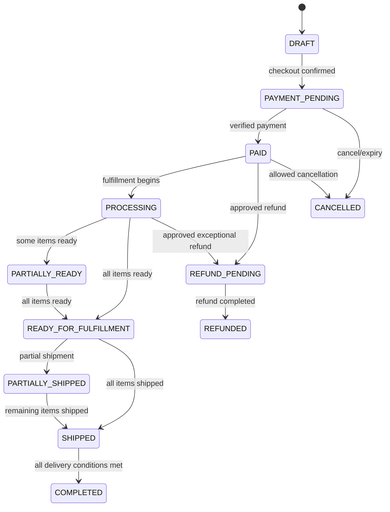

## Transition rules

### DRAFT → PAYMENT_PENDING

Requires:

- validated Cart;
- valid customer;
- valid delivery information;
- stable commercial snapshot;
- OrderItems created.

### PAYMENT_PENDING → PAID

Requires:

- `PaymentSucceeded`;
- provider verification complete;
- amount validated;
- idempotency check passed.

### PAID → PROCESSING

Requires:

- at least one OrderItem is released for fulfillment/production.

### PROCESSING → READY_FOR_FULFILLMENT

Requires:

- every non-cancelled OrderItem is ready for shipment/fulfillment.

### READY_FOR_FULFILLMENT → SHIPPED

Requires:

- all applicable items are assigned to dispatched Shipment(s).

### SHIPPED → COMPLETED

Requires:

- delivery completion policy satisfied.

Exact completion policy may be:

- all Shipments delivered;
- manual completion in some shipping methods.

### Cancellation

Cancellation eligibility depends on:

- payment state;
- whether production has started;
- item type;
- refund policy.

The final cancellation policy is deferred to research but the state machine must support controlled cancellation.

---

# 4. OrderItem Fulfillment State Machine

Each OrderItem tracks customer-level fulfillment separately from internal ProductionJob state.

## States

```text
PENDING
AWAITING_PRODUCTION
IN_PRODUCTION
IN_QC
READY_TO_SHIP
PARTIALLY_FULFILLED
SHIPPED
DELIVERED
CANCELLED
FAILED_REQUIRES_ATTENTION
```

## Flow

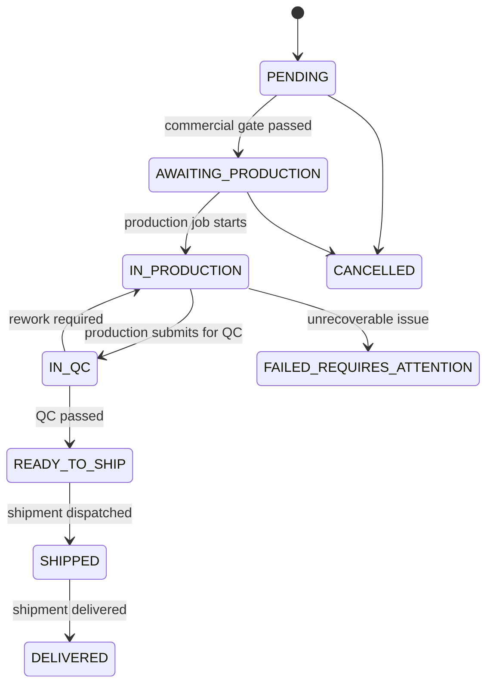

## Important rule

`OrderItem.IN_PRODUCTION` is a customer/commercial projection.

Detailed machine states remain in `ProductionJob`.

---

# 5. Payment State Machine

## Payment states

```text
CREATED
PENDING_PROVIDER
AWAITING_VERIFICATION
SUCCEEDED
FAILED
CANCELLED
EXPIRED
PARTIALLY_REFUNDED
REFUNDED
```

## PaymentAttempt states

```text
CREATED
REDIRECTED
CALLBACK_RECEIVED
VERIFICATION_PENDING
VERIFIED
FAILED
CANCELLED
EXPIRED
```

## Payment flow

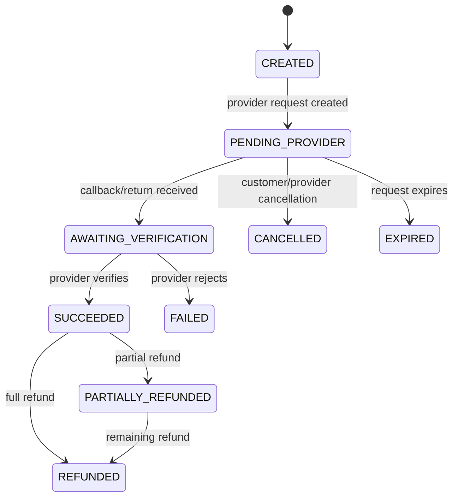

## Rules

- Browser redirect alone never moves Payment to `SUCCEEDED`.
- Verification must be server-side.
- Duplicate callbacks must resolve to the same final state.
- Once `SUCCEEDED`, another attempt cannot apply the same payable amount again.
- Refund states must preserve original Payment success history.

---

# 6. AI Design Session State Machine

The DesignSession tracks the overall customer AI design workflow.

## States

```text
ACTIVE
WAITING_FOR_GENERATION
WAITING_FOR_VALIDATION
WAITING_FOR_CUSTOMER_SELECTION
SUBMITTED_FOR_REVIEW
REVISION_REQUIRED
APPROVED
REJECTED
PURCHASABLE
PURCHASED
ARCHIVED
```

## Flow

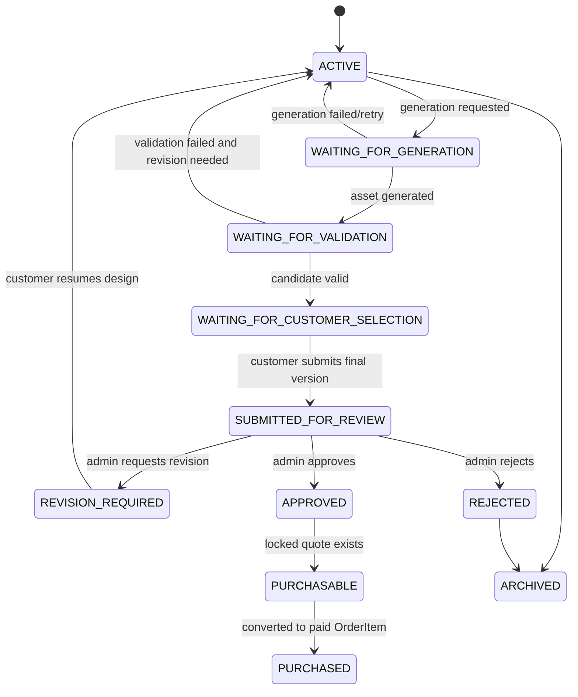

## Notes

A DesignSession may remain `ACTIVE` while several DesignVersions exist.

The final candidate must always identify one explicit DesignVersion.

---

# 7. DesignVersion State Machine

A DesignVersion is immutable content, but its processing/review lifecycle still has state.

## States

```text
DRAFT
GENERATION_PENDING
GENERATED
VALIDATION_PENDING
VALIDATION_FAILED
VALIDATED
PRICING_PENDING
PRICED
FINAL_CANDIDATE
SUBMITTED
APPROVED
REJECTED
SUPERSEDED
```

## Flow

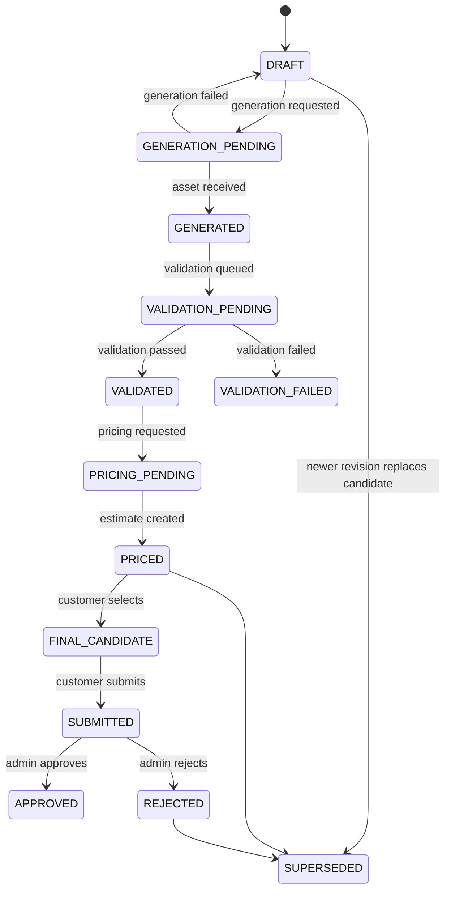

## Important rules

- Content never mutates after creation.
- A rejected version remains historical.
- `SUPERSEDED` does not mean deleted.
- Approved version must remain traceable to validation and pricing artifacts.

---

# 8. AI Review State Machine

The review decision should remain explicit.

## States

```text
NOT_SUBMITTED
PENDING_REVIEW
CHANGES_REQUESTED
APPROVED
REJECTED
```

## Flow

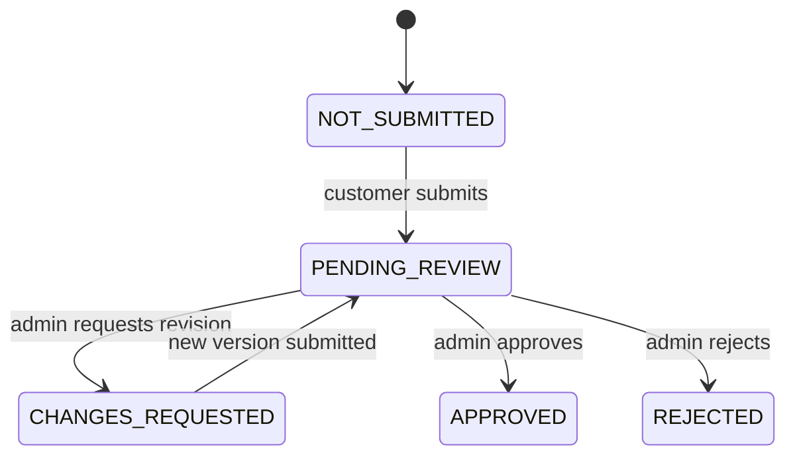

## Rules

- Only staff with explicit permission may transition out of `PENDING_REVIEW`.
- Approval must identify:
  - DesignVersion;
  - reviewer;
  - timestamp.
- Rejection/change request must include a reason.

---

# 9. AI Quote State Machine

## States

```text
DRAFT
ESTIMATED
UNDER_REVIEW
ADJUSTED
APPROVED
LOCKED
EXPIRED
CONSUMED
CANCELLED
```

## Flow

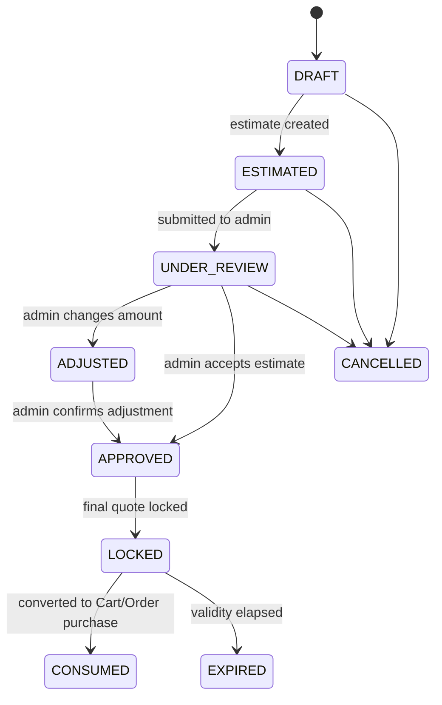

## Rules

- Only `LOCKED` Quote can become purchasable.
- `CONSUMED` Quote cannot be reused for another independent purchase unless policy explicitly supports it.
- Override must preserve:
  - original estimate;
  - final amount;
  - reason;
  - actor.

---

# 10. 3D Generation Job State Machine

## States

```text
QUEUED
SUBMITTED_TO_PROVIDER
PROCESSING
SUCCEEDED
FAILED
CANCELLED
TIMED_OUT
```

## Flow

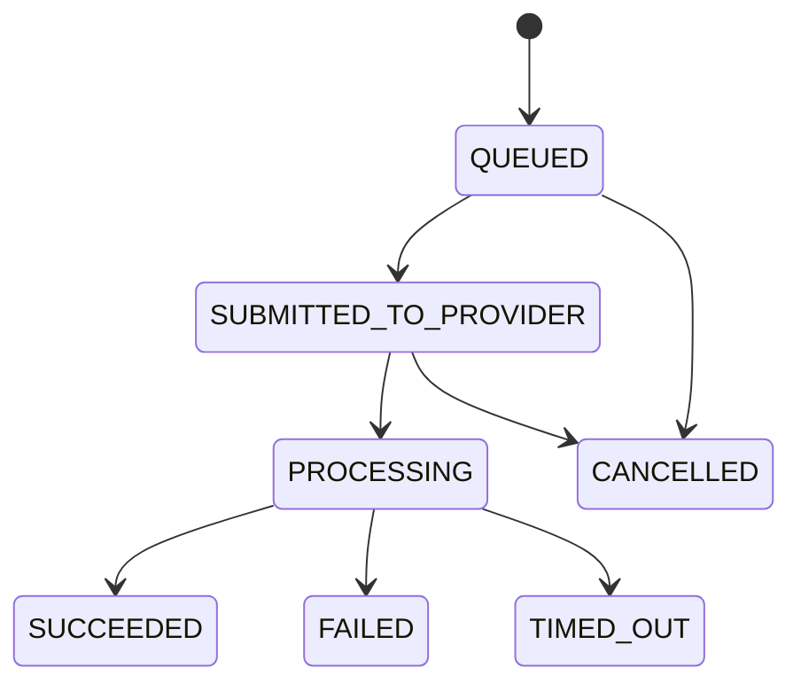

## Rules

- Provider status is mapped into these internal states.
- Provider-specific status strings must not become domain states.
- Failed job must preserve error/provider metadata.
- Retry usually creates a new attempt/job record rather than erasing history.

---

# 11. 3D Validation State Machine

## States

```text
QUEUED
PROCESSING
PASSED
PASSED_WITH_WARNINGS
FAILED_TECHNICAL
FAILED_MODEL
```

## Meaning

### FAILED_TECHNICAL
The validation process/tool failed.

Example:

- worker crash;
- timeout;
- parser failure.

### FAILED_MODEL
The model was processed successfully but violated required constraints.

This distinction is critical.

---

# 12. Slicing State Machine

## States

```text
QUEUED
PROCESSING
SUCCEEDED
FAILED_TECHNICAL
FAILED_MODEL
TIMED_OUT
```

A successful SliceResult should identify the source asset/profile and extracted metrics.

---

# 13. ProductionJob State Machine

## States

```text
CREATED
QUEUED
ASSIGNED
PREPARING
PRINTING
POST_PROCESSING
WAITING_FOR_QC
QC_FAILED
REWORK
COMPLETED
FAILED
CANCELLED
```

## Flow

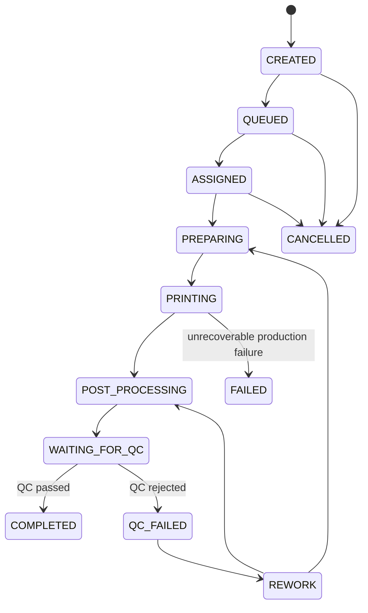

## Rules

- `COMPLETED` requires successful QC.
- `FAILED` is different from `QC_FAILED`.
- Rework may return to preparation/printing/post-processing depending on failure.
- Actual printer/profile/material used should be recorded before or during execution.

---

# 14. Quality Control State Machine

## States

```text
PENDING
IN_REVIEW
PASSED
FAILED
REWORK_REQUIRED
```

## Flow

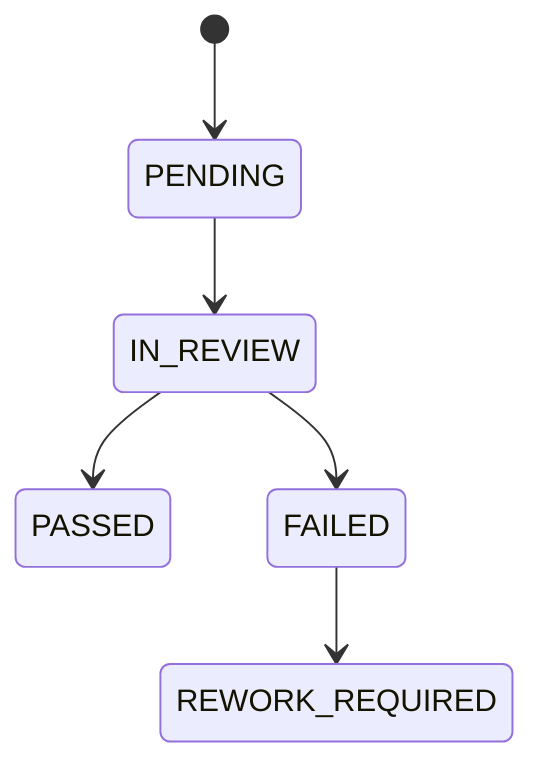

A new QC record/attempt may be created after rework.

---

# 15. PersonalizationRequest State Machine

## States

```text
DRAFT
SUBMITTED
UNDER_REVIEW
CLARIFICATION_REQUIRED
REJECTED
QUOTE_PENDING
QUOTE_ISSUED
AWAITING_INITIAL_PAYMENT
AWAITING_PHYSICAL_ITEM
ITEM_RECEIVED
INSPECTION_PENDING
INSPECTION_REJECTED
REQUOTE_REQUIRED
AWAITING_REQUOTE_ACCEPTANCE
READY_FOR_MANUAL_WORK
IN_MANUAL_WORK
IN_QC
AWAITING_REMAINING_BALANCE
READY_FOR_RETURN
RETURN_SHIPPED
COMPLETED
CANCELLED
```

## Main flow

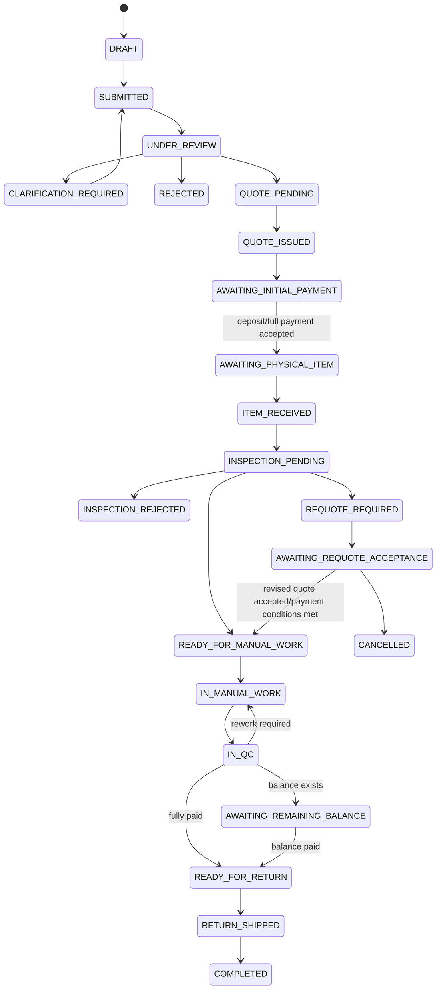

## Rejection after receipt

`INSPECTION_REJECTED` may lead to:

```text
RETURN_SHIPPED
CANCELLED
```

depending on refund/return policy.

## Rules

- Physical work never starts before `READY_FOR_MANUAL_WORK`.
- `READY_FOR_RETURN` requires any required balance to be paid.
- Pre-approval before item arrival does not skip Inspection.
- Revised Quote must remain versioned.

---

# 16. Personalization Quote State Machine

## States

```text
DRAFT
ISSUED
ACCEPTED
PARTIALLY_PAID
PAID
SUPERSEDED
REJECTED
EXPIRED
CANCELLED
```

## Notes

A new quote after physical Inspection should normally supersede the previous active quote rather than mutate it in place.

---

# 17. Physical Item Receipt State Machine

## States

```text
EXPECTED
RECEIVED
CONDITION_RECORDED
TRANSFERRED_TO_INSPECTION
RETURN_PENDING
RETURNED
```

This state machine may remain internal-only.

---

# 18. Inspection State Machine

## States

```text
PENDING
IN_PROGRESS
PASSED
FAILED
REQUOTE_REQUIRED
```

## Rules

Inspection must distinguish:

- technical unsuitability;
- existing physical damage;
- mismatch with customer description;
- increased complexity requiring revised price.

---

# 19. ManualWorkJob State Machine

## States

```text
CREATED
ASSIGNED
IN_PROGRESS
WAITING_FOR_QC
REWORK
COMPLETED
CANCELLED
```

## Flow

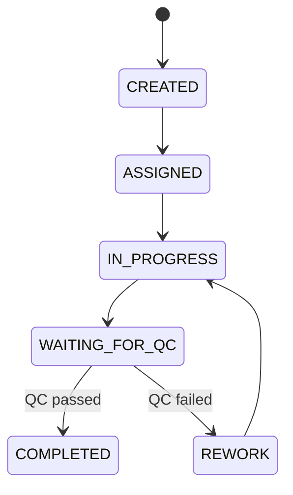

---

# 20. Shipment State Machine

## States

```text
DRAFT
READY
LABEL_CREATED
DISPATCHED
IN_TRANSIT
DELIVERED
DELIVERY_FAILED
RETURNED
CANCELLED
```

`LABEL_CREATED` may be skipped for manually-managed shipping.

## Flow

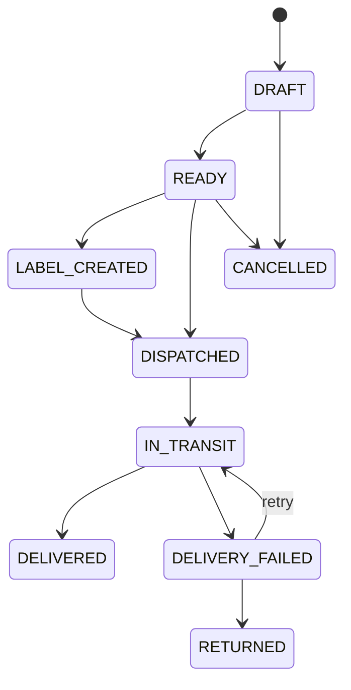

---

# 21. Notification Delivery State Machine

## States

```text
CREATED
QUEUED
SENDING
DELIVERED
FAILED_RETRYABLE
FAILED_FINAL
READ
```

For in-app notifications, `READ` is a user interaction state and may coexist conceptually with delivery state.

Implementation may separate `deliveryStatus` and `readAt`.

---

# 22. Invoice State Machine

## States

```text
DRAFT
GENERATING
ISSUED
GENERATION_FAILED
REPLACED
VOID
```

A corrected/reissued Invoice should preserve history rather than overwrite the original invisibly.

---

# 23. Customer-Facing Status Mapping

Internal state should not always be shown verbatim.

Example mapping:

| Internal State | Customer Persian Status |
|---|---|
| PAYMENT_PENDING | در انتظار پرداخت |
| PAID | پرداخت شده |
| AWAITING_PRODUCTION | در صف آماده‌سازی |
| IN_PRODUCTION | در حال تولید |
| IN_QC | کنترل کیفیت |
| READY_TO_SHIP | آماده ارسال |
| SHIPPED | ارسال شده |
| DELIVERED | تحویل شده |
| REVISION_REQUIRED | نیازمند اصلاح |
| SUBMITTED_FOR_REVIEW | در انتظار بررسی |
| AWAITING_PHYSICAL_ITEM | منتظر ارسال محصول |
| INSPECTION_PENDING | در حال بررسی محصول |
| AWAITING_REMAINING_BALANCE | در انتظار تسویه |
| READY_FOR_RETURN | آماده ارسال به شما |

Exact wording should be reviewed during UX work.

---

# 24. Transition Authorization

Examples:

## Customer-permitted transitions

- submit AI final candidate;
- accept Personalization Quote;
- initiate payment;
- cancel where policy allows;
- resubmit after clarification.

## Admin-permitted transitions

- approve/reject AI design;
- issue/revise Quote;
- approve/reject Personalization request;
- perform exceptional state correction with audit.

## Designer-permitted transitions

- assigned ManualWorkJob:
  - start;
  - submit for QC;
  - respond to rework.

## Production Operator-permitted transitions

- assigned ProductionJob:
  - preparing;
  - printing;
  - post-processing;
  - submit for QC;
  - record failure.

Every privileged transition is subject to permission checks.

---

# 25. Transition History Requirements

At minimum, transition history should exist for:

- Order;
- OrderItem;
- AI Review;
- AI Quote;
- ProductionJob;
- PersonalizationRequest;
- Inspection;
- Shipment.

Recommended fields:

```text
id
entityId
fromState
toState
actorType
actorId
reasonCode
reasonText
metadata
occurredAt
correlationId
```

Do not expose all internal reason/metadata to customers automatically.

---

# 26. Exceptional Manual Corrections

Some states may occasionally require Admin correction.

Manual correction must:

1. require explicit permission;
2. require reason;
3. record previous state;
4. record new state;
5. create AuditLog;
6. not silently bypass financial invariants.

Examples:

- correcting a mistakenly marked shipment;
- reconciling a legacy order;
- repairing a failed integration state.

Manual correction must not become the normal workflow.

---

# 27. Idempotent Transition Rule

Transition handlers must be safe when the same event is received more than once.

Example:

```text
PaymentSucceeded(paymentId=123)
```

received twice must not:

- pay the Order twice;
- create duplicate ProductionJobs;
- issue duplicate balance application.

A duplicate event may safely result in:

```text
already_applied
```

without changing state.

---

# 28. Cross-State Invariants

## INV-001

An Order cannot be `PAID` unless required payment has been verified.

## INV-002

An AI Design cannot be `PURCHASABLE` unless:

- DesignVersion approved;
- Quote locked;
- required validation complete.

## INV-003

A ProductionJob cannot begin unless its associated OrderItem passed the required commercial gate.

## INV-004

An OrderItem cannot become `READY_TO_SHIP` without successful QC.

## INV-005

A PersonalizationRequest cannot enter `IN_MANUAL_WORK` without successful physical Inspection.

## INV-006

A PersonalizationRequest cannot enter `READY_FOR_RETURN` while required RemainingBalance is unpaid.

## INV-007

A Shipment cannot mark an Order completed unless the required fulfillment policy is satisfied.

## INV-008

A rejected DesignVersion cannot later become approved without a new explicit review transition; typically a revised version is used instead.

---

# 29. State-Machine Implementation Guidance

Recommended implementation:

- domain/application transition methods;
- explicit enums;
- transition guards;
- per-domain status-history records;
- events emitted after successful transitions;
- tests for every allowed and disallowed transition.

Avoid implementing state machines as one giant global workflow engine unless later complexity justifies it.

A lightweight explicit domain approach is sufficient initially.

---

# 30. Testing Requirements

For each state machine, tests should cover:

## Happy path

Every valid primary transition.

## Invalid transition

Examples:

```text
PAYMENT_PENDING → COMPLETED
DRAFT DesignVersion → APPROVED
ITEM_RECEIVED → IN_MANUAL_WORK without Inspection
PRINTING → READY_TO_SHIP without QC
```

must fail.

## Authorization

Unauthorized actor cannot trigger privileged transition.

## Idempotency

Repeated event/command does not duplicate side effects.

## Required data

Transition fails when required data is missing.

---

# 31. Open Policy Dependencies

Some transitions exist but exact eligibility depends on unresolved policy research:

- Order cancellation after production begins;
- refund transitions;
- Quote expiry;
- partial shipment;
- Personalization deposit cancellation;
- rejected physical-item refund/return flow.

These should not be guessed during implementation.

The state machines must support these branches, but the final guards depend on the relevant research documents.

---

# 32. Completion Criteria

Task `01.04 — Define state machines` is complete when:

- Order lifecycle is explicit;
- OrderItem lifecycle is separate from Order;
- Payment lifecycle is separate from business workflow;
- AI session/version/review/quote states are explicit;
- 3D generation/validation/slicing states are explicit;
- ProductionJob and QC lifecycle are explicit;
- Personalization request/quote/inspection/manual-work lifecycle is explicit;
- Shipment lifecycle is explicit;
- valid/invalid transitions can be tested;
- transition authorization and history rules are defined;
- important cross-state invariants are documented;
- policy-dependent transitions are clearly marked as unresolved rather than guessed.

The next task, `01.05 — Define event model`, maps these state changes and business actions into reliable synchronous/asynchronous events.
